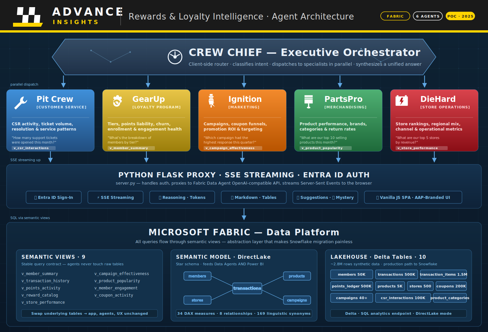

# AAP Data Agent POC

A Microsoft Fabric Data Agent proof-of-concept for **Advance Auto Parts** — enables the marketing team to query rewards/loyalty data using natural language through a chat web app.

## Architecture



```
Azure PostgreSQL  →  Fabric Mirroring  →  OneLake Lakehouse
                                              ↓
                                      Fabric Data Agent (NL → DAX)
                                              ↓
                                      Python API (Container Apps)
                                              ↓
                                      Web App (HTML/JS chat UI)
                                              ↓
                                      Azure Container Apps + Entra ID
```

**Data flow:** PostgreSQL → Fabric Mirroring → Lakehouse → Semantic Model → Data Agent → Flask API → Chat UI

## What's Inside

```
web/               Static frontend — chat UI with 5 agent tabs
api/               Azure Functions backend (superseded by Container Apps)
agents/            5 Fabric Data Agent configs + instruction files
reports/           Power BI PBIR report definition (LoyaltyOverview)
scripts/           Semantic model definition, sample data generator
notebooks/         Fabric notebooks for data pipeline
docs/              Architecture, schema, semantic model docs
config/            Environment and deployment configs
```

### Data Agents (5 specialized)

| Agent | Domain | Key Queries |
|-------|--------|-------------|
| **Loyalty Program Manager** | Members, tiers, points, churn | "How many Platinum members?", "Churn risk breakdown" |
| **Store Operations** | Stores, revenue, channels | "Top 5 stores by revenue", "In-store vs online mix" |
| **Merchandising** | Products, categories, SKUs | "Best-selling category?", "Bonus-eligible products" |
| **Marketing & Promotions** | Campaigns, coupons, redemption | "Campaign ROI this quarter", "Redemption rate" |
| **Customer Service** | CSR activities, member support | "Average tickets per day", "Most common issue type" |

### Semantic Model

- **10 tables:** loyalty_members, transactions, stores, products, coupons, coupon_rules, points_ledger, csr, csr_activities, audit_log
- **30+ DAX measures** across membership, revenue, points, store performance, and product domains
- **Direct Lake mode** from Fabric Lakehouse

## Quick Start

### Local Development

```bash
# Install Python deps
pip install flask flask-cors azure-identity

# Login to Azure (for Fabric API access)
az login

# Run local dev server
python web/server.py
# Opens at http://localhost:5000
```

### Deploy to Azure

The app deploys as an **Azure Container App** — a single container running Flask + gunicorn that serves both static files and the API proxy, secured by Entra ID (MSAL).

**Quickest path:**

```bash
# 1. Create the Container App infrastructure
./scripts/deploy-web.ps1

# 2. Build and push the Docker image
docker build -t ghcr.io/YOUR_ORG/aap-loyalty-intelligence:latest ./web
docker push ghcr.io/YOUR_ORG/aap-loyalty-intelligence:latest

# 3. Update the Container App
az containerapp update \
  --name aap-loyalty-intelligence \
  --resource-group aap-poc-rg \
  --image ghcr.io/YOUR_ORG/aap-loyalty-intelligence:latest

# 4. Configure Entra ID app registration:
#    Set ENTRA_CLIENT_ID and ENTRA_CLIENT_SECRET env vars

# 5. Grant managed identity Contributor on Fabric workspace
```

See **[web/SETUP.md](web/SETUP.md)** for the full step-by-step deployment guide including:
- Container App setup
- Entra ID app registration (MSAL auth)
- Managed identity setup for Fabric API
- CI/CD via GitHub Actions

### Auth

All API routes require Entra ID authentication (MSIT tenant: `72f988bf`). Unauthenticated users are redirected to `/auth/login`. The Flask backend uses `DefaultAzureCredential` (managed identity in prod, browser login locally).

## Fabric Workspace Setup

1. **Create workspace** in [Fabric Portal](https://msit.powerbi.com)
2. **Connect git** to this repo for git sync (semantic model, reports)
3. **Run sample data generator:** `python scripts/generate_sample_data.py`
4. **Load data** via notebooks in `notebooks/`
5. **Configure Data Agents** using configs in `agents/*/config.json`
6. **Deploy report** — `reports/LoyaltyOverview.Report/` syncs via git integration

## Key Docs

| Doc | What |
|-----|------|
| [Architecture](docs/architecture.md) | Full technical architecture (all 4 phases) |
| [Data Schema](docs/data-schema.md) | Placeholder schema, DDL, contract views, sample queries |
| [Semantic Model](docs/semantic-model-architecture.md) | Model review, DAX measures, AI readiness |
| [Web Setup](web/SETUP.md) | Azure Container Apps deployment guide |
| [Report README](reports/LoyaltyOverview.Report/README.md) | PBIR report + verified answer mapping |

## Tech Stack

- **Frontend:** Vanilla HTML/CSS/JS (no framework — POC simplicity)
- **Backend:** Flask + gunicorn (Python)
- **Hosting:** Azure Container Apps
- **Auth:** Azure Entra ID (MSAL middleware in Flask)
- **Data Platform:** Microsoft Fabric (Lakehouse, Semantic Model, Data Agent)
- **Source DB:** Azure PostgreSQL (mirrored via Fabric)

## License

Internal Microsoft POC — not for external distribution.
