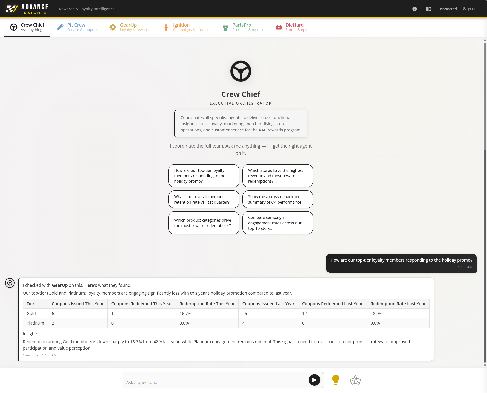

# AAP Data Agent POC

A Microsoft Fabric Data Agent proof-of-concept for **Advance Auto Parts** — enables the marketing team to query rewards/loyalty data using natural language through a chat web app.

## Architecture




```
Azure PostgreSQL  →  Fabric Mirroring  →  OneLake Lakehouse
                                              ↓
                                      Fabric Data Agent (NL → DAX)
                                              ↓
                                      Python API (Flask)
                                              ↓
                                      Web App (HTML/JS chat UI)
```

**Data flow:** PostgreSQL → Fabric Mirroring → Lakehouse → Semantic Model → Data Agent → Flask API → Chat UI

## What's Inside

```
web/               Frontend + Flask backend — chat UI with 6 agent tabs
  server.py        Flask app (API proxy + static files)
  docs.html        Interactive documentation page
api/               Azure Functions backend (legacy/reference only — not active)
agents/            5 Fabric Data Agent configs + instruction files
reports/           Power BI PBIR report definition (LoyaltyOverview)
scripts/           Semantic model definition, sample data generator
notebooks/         Fabric notebooks for data pipeline
docs/              Architecture, schema, semantic model docs
config/            Environment and deployment configs
tests/cua/         CUA visual test suite — 42 Gherkin scenarios across 6 feature files
```

### Data Agents (6 tabs, 5 Fabric agents)

| Tab | Agent | Domain | Key Queries |
|-----|-------|--------|-------------|
| **Crew Chief** | *(client-side orchestrator)* | Routes queries to specialized agents | "Who should I ask about churn?" |
| **GearUp** | Loyalty Program Manager | Members, tiers, points, churn | "How many Platinum members?", "Churn risk breakdown" |
| **DieHard** | Store Operations | Stores, revenue, channels | "Top 5 stores by revenue", "In-store vs online mix" |
| **PartsPro** | Merchandising | Products, categories, SKUs | "Best-selling category?", "Bonus-eligible products" |
| **Ignition** | Marketing & Promotions | Campaigns, coupons, redemption | "Campaign ROI this quarter", "Redemption rate" |
| **Pit Crew** | Customer Service | CSR activities, member support | "Average tickets per day", "Most common issue type" |

### Semantic Model

- **10 tables:** loyalty_members, transactions, stores, products, coupons, coupon_rules, points_ledger, csr, csr_activities, audit_log
- **30+ DAX measures** across membership, revenue, points, store performance, and product domains
- **Direct Lake mode** from Fabric Lakehouse

**Linguistic synonyms** are configured on the model so natural language queries resolve correctly — e.g. "customers" → `loyalty_members`, "sales" → `transactions`, "parts" → `sku_reference`. Includes table-level, column-level ("loyalty tier" → `tier`), and value-level ("VIP" → Platinum) synonyms. See `scripts/configure-linguistic-schema.py` for the full synonym map.

**AI instructions** are embedded in the model's Copilot settings — business context, tier definitions, points system rules, and calculation guardrails (e.g. "Revenue should ALWAYS filter to transaction_type = 'purchase'"). These guide the Data Agent's DAX generation so it gets domain-specific queries right.

**Per-agent instruction files** live in `agents/*/` — each of the 5 Fabric Data Agents has its own persona, data access scope, response format rules, and example queries tailored to its domain (loyalty, marketing, merchandising, store ops, customer service).

## Quick Start

```bash
# Install Python deps
pip install flask flask-cors azure-identity

# Login to Azure (for Fabric API access)
az login

# Run local dev server
python web/server.py
# Opens at http://localhost:5000
```

No Azure deployment required. The Flask server serves both the static frontend and the API proxy. Authentication uses your `az login` credentials automatically.

### Auth (Local Development)

The Flask server authenticates to the Fabric Data Agent API using `ChainedTokenCredential` with this fallback chain:

1. `ManagedIdentityCredential` — for future Azure Container Apps deployment
2. `AzureCliCredential` — **primary for local dev** (uses your `az login` session)
3. `DeviceCodeCredential` — headless/Docker fallback

No MSAL, no login screen, no app registration needed for local development. Just `az login` and go.

### Future: Production Deployment

> **Not yet implemented.** The sections below describe the planned Azure Container Apps deployment.

The app is designed to deploy as an **Azure Container App** — a single container running Flask + gunicorn that serves both static files and the API proxy, secured by Entra ID (MSAL).

See **[web/SETUP.md](web/SETUP.md)** for the full deployment guide including:
- Container App setup (§3)
- Entra ID app registration / MSAL auth (§4)
- Fabric workspace access via service principal (§5)
- CI/CD via GitHub Actions (§6)

## Fabric Workspace Setup

1. **Create workspace** in [Fabric Portal](https://msit.powerbi.com)
2. **Connect git** to this repo for git sync (semantic model, reports)
3. **Run sample data generator:** `python scripts/generate_sample_data.py`
4. **Load data** via notebooks in `notebooks/`
5. **Configure Data Agents** using configs in `agents/*/config.json`
6. **Deploy report** — `reports/LoyaltyOverview.Report/` syncs via git integration

## Key Docs

| Doc | What |
|-----|------|
| [Interactive Docs](web/docs.html) | Stakeholder-facing documentation page (served by Flask) |
| [Architecture](docs/architecture.md) | Full technical architecture (all 4 phases) |
| [Data Schema](docs/data-schema.md) | Placeholder schema, DDL, contract views |
| [Semantic Model](docs/semantic-model-architecture.md) | Model review, DAX measures, AI readiness |
| [Web Setup](web/SETUP.md) | Deployment guide (local + future Container Apps) |
| [CUA Tests](tests/cua/README.md) | Visual test suite — 42 Gherkin scenarios |
| [Report README](reports/LoyaltyOverview.Report/README.md) | PBIR report + verified answer mapping |

## Tech Stack

- **Frontend:** Vanilla HTML/CSS/JS (no framework — POC simplicity)
- **Backend:** Flask (Python) — `web/server.py`
- **Hosting:** Local Flask dev server (Azure Container Apps planned for production)
- **Auth:** Azure Entra ID via `ChainedTokenCredential` (`az login` for local dev)
- **Data Platform:** Microsoft Fabric (Lakehouse, Semantic Model, Data Agent)
- **Source DB:** Azure PostgreSQL (mirrored via Fabric)

## Security

The Flask server authenticates to the Fabric Data Agent API using `ChainedTokenCredential` (ManagedIdentity → AzureCli → DeviceCode). In local development, your `az login` session provides the token. For production deployment, see [Security in SETUP.md](web/SETUP.md#security).

## License

[MIT License](LICENSE) — Copyright © 2026 Dave Grobleski
