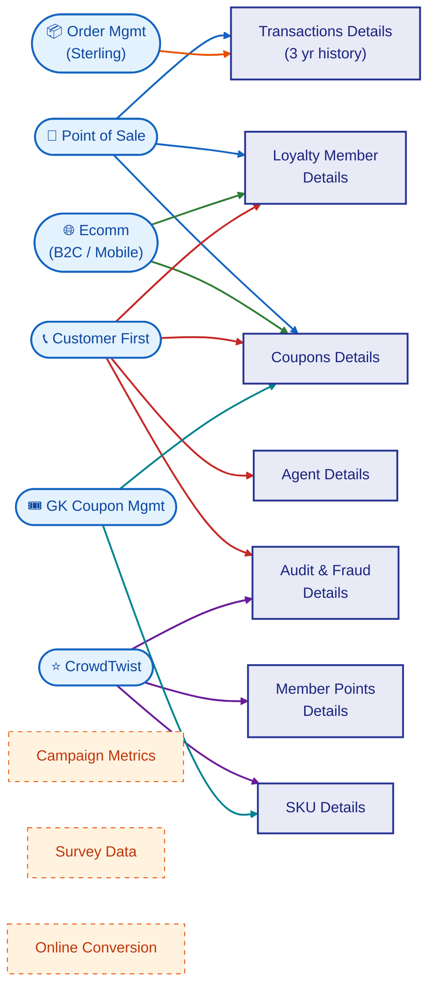

# AAP Data Model Alignment & Gap Analysis

**Source:** AAP Loyalty Platform Data Model diagram (customer-provided)  
**Compared Against:** POC schema (`notebooks/01-create-sample-data.py`) and semantic model  
**Date:** 2026-04-26

---

## Customer Source Schema (as of 2026-04-26)

### Source → Loyalty Database Mapping

Each data source feeds specific entity groups in the loyalty database. The color-coded lines in the architecture diagram converge through a central bus, representing data integration paths (likely external SQL links or ETL pipelines).

| Data Source | Data Elements | → Loyalty DB Entity | Mapping Rationale |
|---|---|---|---|
| **Point of Sale** | Transactions (purchases & returns) | **Transactions Details** | POS purchase/return records are the primary transaction source |
| **Point of Sale** | New member enrollment | **Loyalty Member Details** | In-store enrollment creates member records |
| **Point of Sale** | Coupon Redemption | **Coupons Details** | POS captures coupon scans at checkout |
| **Order Mgmt (Sterling)** | Transactions (purchases & returns) | **Transactions Details** | Order fulfillment feeds consolidated transaction history |
| **Ecomm (B2C/mobile)** | New member enrollment, New DIY account | **Loyalty Member Details** | Online enrollment and DIY accounts create member records |
| **Ecomm (B2C/mobile)** | Coupon Redemption | **Coupons Details** | Online coupon redemptions at checkout |
| **Customer First** | Member enrollment, status modifications | **Loyalty Member Details** | CRM manages member lifecycle and status changes |
| **Customer First** | Coupon Adjustment | **Coupons Details** | Service agents adjust coupons for customers |
| **Customer First** | CSR (agent) | **Agent Details** | Customer service representative records |
| **Customer First** | All agent/member/coupon activity | **Audit and Fraud Details** | CRM interactions create audit trail |
| **CrowdTwist** | Points Earned, Tier Status | **Member Points Details** | Loyalty engine is source of truth for points and tiers |
| **CrowdTwist** | Bonus Activities | **SKU Details** | Bonus activity SKU configurations |
| **CrowdTwist** | Points/tier change history | **Audit and Fraud Details** | Loyalty activity tracked for fraud detection |
| **GK Coupon Mgmt** | Coupon issuance, definitions, usage | **Coupons Details** | Coupon platform manages rules, issuance, and status |
| **GK Coupon Mgmt** | SKU-level coupon rules | **SKU Details** | Product-level coupon skip/include rules |

### Architecture Diagram

**Legend:** 🔵 POS &nbsp; 🟠 OMS &nbsp; 🟢 Ecomm &nbsp; 🔴 Customer First &nbsp; 🟣 CrowdTwist &nbsp; 🔷 GK Coupon

**Phase 2** (dashed) sources are not yet integrated: Campaign Metrics, Survey Data, Online Conversion.

---

## 1. AAP Reference Architecture (from diagram)

### Data Sources (6 upstream systems)

| System | Data Flowing In |
|--------|----------------|
| **Point of Sale** | Transactions (purchases & returns), Coupon Redemption, New member enrollment |
| **Ecomm (B2C and mobile app)** | New member enrollment, New DIY account, Coupon Redemption |
| **Order Management System (Sterling)** | Transactions (purchases and returns) |
| **Customer First** | Member enrollment, Member status modifications, Coupon Adjustment, CSR (agent) |
| **CrowdTwist** | Points Earned, Tier Status, Bonus Activities, Campaigns |
| **GK Coupon Management** | Coupon issuance, Coupon definitions, Coupon usage |

### Loyalty Database (7 entity groups)

| Entity Group | Key Attributes |
|-------------|---------------|
| **Transactions Details** (3 years) | Purchases, Returns |
| **Loyalty Member Details** | Member Info, Opt Ins, Member Status, Member Tier Info |
| **Member Points Details** | Total points, Redeemable points, Tier status, Tier rules |
| **Coupons Details** | Coupon rule, Coupon Issuance, Coupon Status, Coupon Reference |
| **Audit and Fraud Details** | Agent activity, Member enrollment history, Coupon history |
| **Agent Details** | CSR agent info |
| **SKU Details** | Skip SKUs, Bonus Activities, SKUs |

### Phase 2 (Future — not in current scope)

| Domain | Attributes |
|--------|-----------|
| **Campaign Metrics** | Engagement by channel, CTR, Opt-outs, Unsubscribe |
| **Survey Data** | Unstructured responses, Consumer sentiment |
| **Online Conversion** | Funnel metrics, Browse and abandon history |

---

## 2. POC Schema (what we built)

| POC Table | Rows | Purpose |
|-----------|------|---------|
| `loyalty_members` | 5,000 | Member profiles, tier, opt-ins, DIY account link |
| `transactions` | 50,000 | 3 years of purchases & returns |
| `transaction_items` | ~150,000 | Line items per transaction |
| `member_points` | 50,000+ | Points ledger (earn, redeem, adjust, expire) |
| `coupons` | 20,000+ | Coupon instances (issued, redeemed, expired, voided) |
| `coupon_rules` | 100 | Campaign-aware coupon rule definitions |
| `stores` | 500 | Store reference data |
| `sku_reference` | 2,000 | Auto parts product catalog |
| `csr` | 500 | Customer service representative profiles |
| `csr_activities` | 50,000 | CSR audit trail |
| `audit_log` | (semantic model) | Cross-entity audit trail |

---

## 3. Entity-by-Entity Alignment

### ✅ Transactions Details → `transactions` + `transaction_items`

| AAP Attribute | POC Coverage | Notes |
|--------------|-------------|-------|
| Purchases | ✅ `transaction_type = 'purchase'` | 92% of transactions |
| Returns | ✅ `transaction_type = 'return'` | 8% of transactions, negative amounts |
| 3 years of data | ✅ 2023-01-01 to 2026-04-01 | 3+ years, seasonal patterns |
| Line item detail | ✅ `transaction_items` table | SKU, quantity, unit price per line |
| Channel (POS/Ecomm/Sterling) | ✅ `channel` column | in-store (70%), online (20%), mobile (10%) |
| Order ID (Sterling) | ✅ `order_id` column | Present for online/mobile orders |

**Alignment: 🟢 Strong** — All core transaction attributes covered. Line-item granularity exceeds diagram's scope.

---

### ✅ Loyalty Member Details → `loyalty_members`

| AAP Attribute | POC Coverage | Notes |
|--------------|-------------|-------|
| Member Info | ✅ first_name, last_name, email, phone | Standard PII fields |
| Opt Ins | ✅ `opt_in_email`, `opt_in_sms` | Email 72%, SMS 45% |
| Member Status | ✅ `member_status` | active/inactive/suspended |
| Member Tier Info | ✅ `tier` column | Bronze/Silver/Gold/Platinum |
| DIY Account (Ecomm) | ✅ `diy_account_id` | 35% of members linked |
| Enrollment Source | ✅ `enrollment_source` | POS, Ecomm, CustomerFirst |

**Alignment: 🟢 Strong** — Full coverage of member attributes including multi-source enrollment tracking.

---

### 🟡 Member Points Details → `member_points` (points_ledger)

| AAP Attribute | POC Coverage | Notes |
|--------------|-------------|-------|
| Total points | ✅ `current_points_balance` on `loyalty_members` | Also `lifetime_points_earned` |
| Redeemable points | 🟡 Implied via `current_points_balance` | No separate "redeemable" vs "pending" distinction |
| Tier status | ✅ `tier` on `loyalty_members` | Denormalized on member record |
| Tier rules | 🟡 Implicit in code | No explicit `tier_rules` table with thresholds/multipliers |
| Points earn/redeem/adjust/expire | ✅ `activity_type` in points_ledger | Full ledger with balance_after |
| Source system tracking | ✅ `source` column | POS, Web, CSR, System |

**Alignment: 🟡 Good with gaps** — Core points data covered. Missing: explicit tier rules table and redeemable vs. pending points split.

**Gaps to close:**
- Add `tier_rules` reference table (tier name, min points threshold, earn multiplier, benefits)
- Consider splitting `current_points_balance` into redeemable + pending if AAP tracks this

---

### ✅ Coupons Details → `coupons` + `coupon_rules`

| AAP Attribute | POC Coverage | Notes |
|--------------|-------------|-------|
| Coupon rule | ✅ `coupon_rules` table | Discount type, value, min purchase, validity |
| Coupon Issuance | ✅ `issued_date`, `coupon_code` | Per-member coupon instances |
| Coupon Status | ✅ `status` column | issued/redeemed/expired/voided |
| Coupon Reference | ✅ `redeemed_transaction_id` | Links to transaction where redeemed |
| Source system | ✅ `source_system` on coupons | GK_Coupon_Mgmt, POS, Ecomm, Customer_First |
| Campaign grouping | ✅ `campaign_name` on coupon_rules | Named campaigns (Holiday Blitz, etc.) |
| Target tier | ✅ `target_tier` on coupon_rules | Tier-restricted offers |

**Alignment: 🟢 Strong** — Full coupon lifecycle covered including multi-source issuance and campaign association.

---

### ✅ Audit and Fraud Details → `csr_activities` + `audit_log`

| AAP Attribute | POC Coverage | Notes |
|--------------|-------------|-------|
| Agent activity | ✅ `csr_activities` table | Member Lookup, Points Adjustment, Coupon Void, etc. |
| Member enrollment history | ✅ `audit_log` entity_type = 'member' | Tracks creates, updates, status changes |
| Coupon history | ✅ `audit_log` entity_type = 'coupon' | Tracks coupon lifecycle events |
| Fraud detection | ❌ Not modeled | No fraud flags, risk scores, or suspicious activity markers |

**Alignment: 🟡 Good with gaps** — Audit trail is solid. Fraud detection is absent but may be out of POC scope.

**Gaps to close:**
- Fraud is explicitly called out in AAP's model. For production, consider a `fraud_flags` table or `risk_score` column
- POC scope: not critical for demo, but should be noted for production roadmap

---

### ✅ Agent Details → `csr`

| AAP Attribute | POC Coverage | Notes |
|--------------|-------------|-------|
| CSR agent info | ✅ csr_id, csr_name, department, hire_date, status | Full agent profiles |
| Activity tracking | ✅ via `csr_activities` (FK to csr) | Linked audit trail |

**Alignment: 🟢 Strong** — Complete CSR representation.

---

### ✅ SKU Details → `sku_reference`

| AAP Attribute | POC Coverage | Notes |
|--------------|-------------|-------|
| SKUs | ✅ sku, product_name, brand, category, subcategory, list_price | 2,000 products |
| Skip SKUs | ✅ `is_skip_sku` boolean | 5% of SKUs excluded from points |
| Bonus Activities | ✅ `is_bonus_eligible` boolean | 15% of SKUs earn bonus points |

**Alignment: 🟢 Strong** — The specific AAP concepts of Skip SKUs and Bonus Activities are directly modeled.

---

## 4. Data Source Traceability

The AAP diagram shows 6 upstream systems feeding the Loyalty Database. Our POC tracks source provenance:

| AAP Source System | POC Traceability | How |
|-------------------|-----------------|-----|
| **Point of Sale** | ✅ | `enrollment_source = 'POS'`, `channel = 'in-store'`, `source = 'POS'` on points |
| **Ecomm (B2C/mobile)** | ✅ | `enrollment_source = 'Ecomm'`, `channel = 'online'/'mobile'`, `diy_account_id` |
| **Order Mgmt (Sterling)** | ✅ | `order_id` on transactions (non-null for online/mobile) |
| **Customer First** | ✅ | `enrollment_source = 'CustomerFirst'`, CSR activities link |
| **CrowdTwist** | 🟡 | Points ledger covers earn/redeem, but no explicit CrowdTwist system marker |
| **GK Coupon Management** | ✅ | `source_system = 'GK_Coupon_Mgmt'` on coupons |

**Overall: 🟢 Strong** — 5 of 6 source systems explicitly traceable. CrowdTwist is implicitly represented through points_ledger but lacks a distinct source marker.

---

## 5. Gap Summary

### 🔴 Not Modeled (Production Gaps)

| Gap | AAP Reference | Impact | Priority |
|-----|--------------|--------|----------|
| **Tier rules table** | "Member Points Details → Tier rules" | Can't query tier thresholds or multipliers dynamically | P1 — Add before production |
| **Fraud detection** | "Audit and Fraud Details" | No fraud flags, risk scores, or suspicious activity tracking | P2 — Production feature |
| **Redeemable vs. pending points** | "Member Points Details → Redeemable points" | Points balance doesn't distinguish redeemable from pending/held | P1 — Important for member queries |
| **CrowdTwist source marker** | Data Sources → CrowdTwist | Points/tier data not explicitly tagged to CrowdTwist origin | P2 — Lineage concern |

### 🟡 Phase 2 Items (Explicitly Out of Scope)

| Domain | What's Needed | Status |
|--------|-------------|--------|
| **Campaign Metrics** | Engagement by channel, CTR, opt-outs, unsubscribe rates | ❌ Not modeled — Phase 2 |
| **Survey Data** | Unstructured consumer responses, sentiment analysis | ❌ Not modeled — Phase 2 |
| **Online Conversion** | Funnel metrics, browse/abandon history | ❌ Not modeled — Phase 2 |

### ✅ POC Extras (We have, AAP diagram doesn't show)

| POC Feature | Value |
|------------|-------|
| `transaction_items` (line-level detail) | Richer than AAP's "Transactions Details" box implies |
| `stores` reference table | Store geography, type, performance analytics |
| Seasonal transaction weighting | Realistic auto parts purchase patterns |
| 30+ DAX measures in semantic model | Pre-built analytics (churn risk, opt-in rates, revenue per store) |
| 5 Fabric Data Agents | Ready for natural language querying |

---

## 6. Alignment Score

| Entity Group | Alignment | Score |
|-------------|-----------|-------|
| Transactions Details | 🟢 Strong | 95% |
| Loyalty Member Details | 🟢 Strong | 95% |
| Member Points Details | 🟡 Good | 80% |
| Coupons Details | 🟢 Strong | 95% |
| Audit and Fraud Details | 🟡 Good | 75% |
| Agent Details | 🟢 Strong | 95% |
| SKU Details | 🟢 Strong | 95% |
| Data Source Traceability | 🟢 Strong | 90% |
| **Overall Phase 1** | **🟢 Strong** | **~90%** |
| Phase 2 Items | 🔴 Not started | 0% |

---

## 7. Recommendations

### For POC Demo (do now)
- ✅ **No blockers.** Current schema is well-aligned for demonstrating the full architecture.
- The 90% alignment is more than sufficient to show natural language querying across all entity groups.

### For Production Transition (when AAP provides real schema)
1. **Add `tier_rules` reference table** — tier name, min points threshold, earn multiplier, benefits description
2. **Split points balance** — separate redeemable, pending, and expired point pools
3. **Add fraud markers** — risk_score column on members, fraud_flag on transactions
4. **Tag CrowdTwist** — add 'CrowdTwist' as a source value in points_ledger
5. **Remap views** — update contract views to point at real AAP tables (the whole point of our abstraction layer)

### For Phase 2
6. Campaign engagement tables (channel, CTR, opt-out tracking)
7. Survey/sentiment data store (likely unstructured → Fabric Lakehouse)
8. Online conversion funnel (browse sessions, cart abandons)
