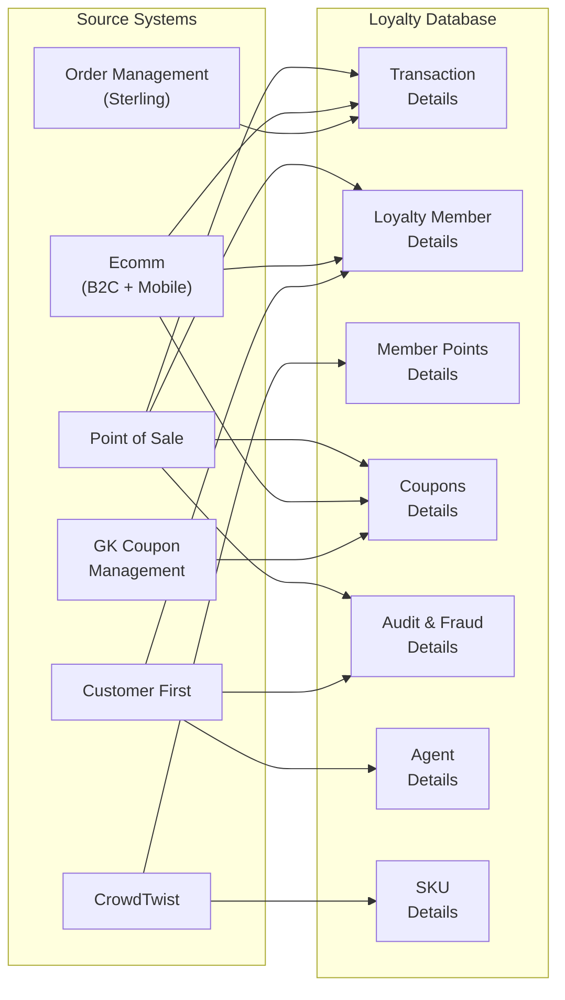

# AAP Loyalty Database — Real Schema Reference

**Document Owner:** Data Engineer  
**Last Updated:** 2025-07  
**Status:** DRAFT — Based on AAP architecture diagram; pending column-level detail

---

> **Context:** This document captures the actual AAP Loyalty Database architecture as provided by
> the AAP team. It supplements the existing placeholder schema (`docs/data-schema.md`) and provides
> a preliminary mapping to our semantic contract views. The placeholder schema remains active until
> production database access is available.

---

## 1. Source Systems

AAP's Loyalty Database is fed by **six source systems**, each responsible for distinct data domains:

| # | Source System | Key Data Feeds |
|---|---|---|
| 1 | **Point of Sale (POS)** | Transactions (purchases/returns), coupon redemption, new member enrollment |
| 2 | **Ecomm** (B2C + mobile app) | New member enrollment, new DIY account creation, coupon redemption |
| 3 | **Order Management System (Sterling)** | Transactions (purchases and returns) |
| 4 | **Customer First** | Member enrollment, member status modifications, coupon adjustments, CSR agent info |
| 5 | **CrowdTwist** | Points earned, tier status, bonus activities, campaigns |
| 6 | **GK Coupon Management** | Coupon issuance, coupon definitions, coupon usage |

---

## 2. Loyalty Database Tables

The Loyalty Database contains **8 core table groups**:

| # | Table Group | Known Fields / Content | Primary Source(s) |
|---|---|---|---|
| 1 | **Transaction Details** | Purchases, returns (3 years retention) | POS, Sterling, Ecomm |
| 2 | **Loyalty Member Details** | Member info, opt-ins, member status, member tier info | POS, Ecomm, Customer First |
| 3 | **Member Points Details** | Total points, redeemable points, tier status, tier rules | CrowdTwist |
| 4 | **Coupons Details** | Coupon rules, coupon issuance, coupon status, coupon reference | GK Coupon Mgmt, POS, Ecomm |
| 5 | **Audit and Fraud Details** | Agent activity, member enrollment history, coupon history | Customer First, POS |
| 6 | **Agent Details** | CSR agent info | Customer First |
| 7 | **SKU Details** | Skip SKUs, bonus activities, SKU reference | CrowdTwist, POS |
| 8 | *(Campaign-adjacent via CrowdTwist)* | Bonus activities, campaigns | CrowdTwist |

> **Note:** Table #8 is inferred — CrowdTwist feeds campaign/bonus data but the diagram does not
> show a distinct "Campaigns" table. Campaign data may be embedded within Member Points Details
> or managed entirely within CrowdTwist. Clarification needed from AAP.

---

## 3. Data Flow Diagram

---

## 4. Phase 2 — Future Data Sources

The following data sources are identified for future phases and are **not currently in the Loyalty Database**:

| Future Source | Content | Potential Use |
|---|---|---|
| **Campaign Metrics** | Engagement by channel, CTR, opt-outs, unsubscribe | Marketing effectiveness analysis |
| **Survey Data** | Unstructured responses, consumer sentiment | Voice-of-customer, NPS tracking |
| **Online Conversion** | Funnel metrics, browse-and-abandon history | Ecomm optimization, retargeting |

---

## 5. Mapping: AAP Tables → Semantic Contract Views

Our existing placeholder defines **7 contract views** that all consuming components depend on.
Below is a preliminary mapping from real AAP tables to these views.

### 5.1 Mapping Table

| Contract View | Description | AAP Source Table(s) | Mapping Confidence | Notes |
|---|---|---|---|---|
| `v_member_summary` | Member profile + tier + points | Loyalty Member Details, Member Points Details | 🟢 High | Good alignment; CrowdTwist tier data enriches member profile |
| `v_transaction_history` | Purchase/return history | Transaction Details | 🟢 High | Direct mapping; 3-year retention matches our needs |
| `v_points_activity` | Points earned/redeemed timeline | Member Points Details | 🟡 Medium | CrowdTwist manages points; need column-level detail on earn/redeem events |
| `v_reward_catalog` | Available rewards + redemption stats | *(No direct AAP table)* | 🔴 Low | AAP may manage rewards within CrowdTwist; no explicit rewards catalog table visible |
| `v_store_performance` | Store-level metrics | Transaction Details | 🟡 Medium | Store ID likely exists on transactions, but no dedicated stores table in diagram |
| `v_campaign_effectiveness` | Campaign ROI + engagement | CrowdTwist (bonus activities, campaigns) | 🟡 Medium | Campaign data exists in CrowdTwist; Phase 2 adds engagement metrics |
| `v_product_popularity` | Product sales performance | Transaction Details, SKU Details | 🟡 Medium | SKU Details provides product reference; transactions provide sales volume |

### 5.2 Gap Analysis

#### Things in AAP schema we don't cover (new domains):

| AAP Domain | Current Coverage | Action Needed |
|---|---|---|
| **Coupons Details** | Minimal — no dedicated coupon view | New view recommended: `v_coupon_activity` |
| **Audit and Fraud Details** | Not modeled | New view recommended: `v_audit_trail` |
| **Agent Details** | Not modeled | New view recommended: `v_agent_activity` (or embed in audit) |
| **SKU Details** (skip SKUs, bonus activities) | Partially covered via products | May need dedicated view or extend `v_product_popularity` |

#### Things in our placeholder that AAP may not have:

| Placeholder Concept | AAP Status | Impact |
|---|---|---|
| **Stores table** | No dedicated stores table visible | Store data may be attributes on transactions; `v_store_performance` needs rethinking |
| **Rewards catalog** | No explicit catalog table | Rewards may be managed in CrowdTwist; `v_reward_catalog` mapping is uncertain |
| **Points expiration tracking** | Unknown | CrowdTwist may handle this; need column-level confirmation |
| **Campaign definitions** | Managed in CrowdTwist | Our placeholder had standalone campaign tables; real data flows differently |

---

## 6. Key Differences from Placeholder Schema

| Area | Placeholder Assumption | AAP Reality |
|---|---|---|
| **Points/Tier Engine** | Simple `points_ledger` table with earn/redeem records | **CrowdTwist** is a full external loyalty engine managing points, tiers, bonus activities, and campaigns |
| **Coupons** | Minimal coverage (no dedicated tables) | **Major domain** — dedicated Coupons Details with rules, issuance, status, references; fed by GK Coupon Management |
| **Audit/Fraud** | Not modeled | **Distinct table group** — tracks agent activity, enrollment history, coupon history |
| **CSR/Agent Tracking** | Not modeled | **Agent Details** table exists, fed by Customer First |
| **SKU Reference** | Products table with catalog info | **SKU Details** is separate — includes skip SKUs and bonus activity SKUs; not a full product catalog |
| **Store Data** | Dedicated `stores` table | **No visible stores table** — store context likely embedded in transaction records |
| **Data Sources** | Single-source assumption | **Six distinct source systems** feeding the loyalty DB via different integration paths |
| **Campaign Management** | Standalone campaign tables | **CrowdTwist-managed** — campaigns, bonus activities, and engagement tracked in external platform |

---

## 7. Recommendations

### 7.1 New Semantic Views to Add

| Proposed View | Purpose | AAP Source |
|---|---|---|
| `v_coupon_activity` | Coupon issuance, redemption, and status tracking | Coupons Details |
| `v_audit_trail` | Member enrollment history, agent activity, fraud signals | Audit and Fraud Details, Agent Details |

### 7.2 Existing Views Requiring Significant Remapping

| View | Change Needed |
|---|---|
| `v_points_activity` | Remap from simple ledger to CrowdTwist-sourced points/tier events |
| `v_reward_catalog` | May need to source from CrowdTwist bonus activities or be restructured entirely |
| `v_store_performance` | Aggregate from transaction-level store attributes rather than dedicated store table |
| `v_campaign_effectiveness` | Source from CrowdTwist campaigns + future Phase 2 engagement metrics |

### 7.3 Abstraction Layer Update Priority

1. **Immediate:** Add `v_coupon_activity` — coupons are a first-class domain in AAP
2. **Immediate:** Add `v_audit_trail` — audit/fraud is distinct and important for compliance
3. **When column-level detail is available:** Remap all 7 existing views to real table columns
4. **Phase 2:** Extend `v_campaign_effectiveness` with engagement/conversion metrics

---

## 8. Next Steps

To complete the mapping from AAP schema to our semantic contract layer, we need the following from AAP:

| # | Information Needed | Purpose |
|---|---|---|
| 1 | **Column-level schema** for all 8 table groups (DDL or data dictionary) | Complete the view remapping with exact column names and types |
| 2 | **CrowdTwist data model** — how points, tiers, and campaigns are structured | Remap `v_points_activity`, `v_reward_catalog`, `v_campaign_effectiveness` |
| 3 | **Store identification** — how store/location is tracked (transaction attribute? separate reference?) | Determine if `v_store_performance` is viable or needs restructuring |
| 4 | **Coupon lifecycle detail** — coupon states, redemption workflow, GK integration points | Design `v_coupon_activity` with correct status transitions |
| 5 | **Data volumes and refresh cadence** — row counts per table, update frequency | Size the Fabric Lakehouse and configure mirroring schedules |
| 6 | **Access method** — direct PostgreSQL connection string, or API/export? | Finalize Fabric Mirroring configuration |
| 7 | **Phase 2 data source owners** — who manages campaign metrics, survey data, conversion data | Plan future integration work |

---

*This document is a living reference. It will be updated as column-level schema detail is received from AAP and the semantic view mapping is finalized.*
