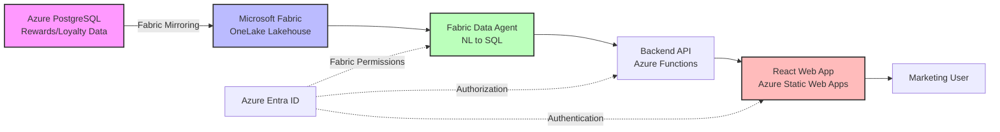
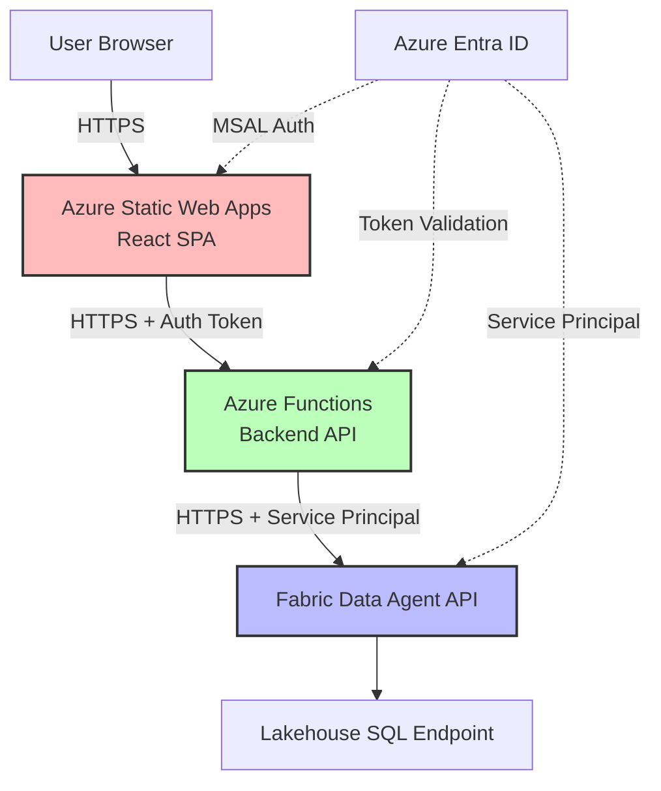

# AAP Data Agent POC — Technical Architecture Document

**Version:** 1.0  
**Date:** April 2026  
**Project:** Advanced Auto Parts Data Agent Proof of Concept  
**Architect:** Danny (Lead/Architect)

---

## Executive Summary

This proof of concept enables Advanced Auto Parts' marketing team to query their Azure PostgreSQL rewards and loyalty data using natural language through Microsoft Fabric's Data Agent capability. The solution leverages AAP's existing Fabric infrastructure to mirror PostgreSQL data into OneLake, configure a Data Agent for natural language query translation, and expose the agent through a simple web application. The architecture is designed with schema abstraction as a first-class concern, enabling seamless replacement of the placeholder data model with production schemas without impacting the broader system architecture.

## Security Architecture

### User-Delegated Authentication (On-Behalf-Of)

The application implements a **zero-trust, user-delegated** authentication model. The user's Azure Entra ID credentials flow end-to-end from the browser through the Flask proxy to the Fabric Data Agent API. The application itself holds **no standing permissions** to access data.

```
Browser → MSAL Login → Entra ID (Fabric scopes)
                              ↓
                    Auth Code + Refresh Token
                              ↓
          Flask Session (encrypted token cache)
                              ↓
          acquire_token_silent → Fabric Access Token
                              ↓
          Fabric Data Agent API (user's delegated permissions)
```

**Design principles:**

1. **No service accounts** — The app authenticates users but never authenticates as itself to access data
2. **Least privilege** — Each user's queries are limited to data they can individually access in Fabric
3. **Zero standing access** — The app has no Fabric workspace role; removing a user's Fabric access immediately revokes their data access through the app
4. **Token isolation** — Per-user MSAL token caches are encrypted in Flask session cookies
5. **Short-lived tokens** — Access tokens expire in ~60 minutes; refresh tokens transparently renew them

This architecture ensures the AI agent can never access data beyond what the authenticated user is authorized to see — the AI has exactly the same permissions as the human operating it.

---

## Solution Architecture Overview



**Data Flow:**
1. Azure PostgreSQL (source system) → Fabric Mirroring → OneLake Lakehouse
2. Fabric Data Agent reads from Lakehouse, translates natural language to SQL
3. Backend API (Azure Functions) authenticates users and proxies requests to Data Agent
4. React web application provides chat interface for marketing team
5. Azure Entra ID secures all layers with unified identity

---

## Phase 1: Fabric OneLake Workspace

### Workspace Configuration

**Workspace Purpose:** Dedicated workspace for AAP rewards/loyalty data and associated Data Agent

**Recommended Configuration:**
- **Workspace Name:** `AAP-RewardsLoyalty-POC` (or production naming convention)
- **Workspace Type:** Standard Fabric workspace with Data Engineering and Data Science capabilities
- **Capacity Assignment:** Assign to one of AAP's existing Fabric capacities
  - Minimum F64 capacity recommended for Mirroring + Data Agent workloads
  - Consider separate capacity for production if POC succeeds
- **Licensing Mode:** Fabric Capacity-based (aligns with AAP's existing Power BI Premium investment)

### Capacity Considerations

**AAP has multiple existing capacities** — capacity selection criteria:
- **Workload Isolation:** Use a non-production capacity for POC to avoid impacting existing Power BI workloads
- **Geographic Location:** Select capacity in same Azure region as PostgreSQL (minimize latency/egress costs)
- **Compute Units:** Mirroring + Data Agent require sustained compute; monitor capacity metrics during POC
- **Auto-scale:** Enable if available to handle query bursts from marketing team

**Capacity Metrics to Monitor:**
- Mirroring throughput (rows/second)
- Data Agent query response times
- CU utilization during peak hours
- Throttling events

### Lakehouse vs Warehouse Decision

**Decision: Use Lakehouse**

**Rationale:**
- **Fabric Mirroring Target:** PostgreSQL mirroring writes directly to Lakehouse Delta tables (native integration)
- **Data Agent Compatibility:** Data Agent can query Lakehouse SQL endpoint or Warehouse; Lakehouse sufficient for POC
- **Cost Efficiency:** Single storage layer (OneLake) vs separate warehouse storage
- **Flexibility:** Lakehouse supports both SQL and Spark workloads if analytics expansion needed
- **Schema Evolution:** Delta Lake format handles schema changes gracefully (critical for schema swap)

**Lakehouse Configuration:**
- **Name:** `RewardsLoyaltyData`
- **Enable SQL endpoint:** Required for Data Agent connectivity
- **Enable schemas:** Use schemas to logically separate mirrored tables from any transformations
  - Schema: `mirrored` — raw mirrored tables from PostgreSQL
  - Schema: `curated` — any transformations or views (future)

### Security and Access Model

**Workspace Roles:**
- **Workspace Admin:** DevOps/Platform team (for provisioning, configuration)
- **Workspace Member:** Data engineers (can create/modify items)
- **Workspace Contributor:** Data Agent (write logs, read data)
- **Workspace Viewer:** Marketing users (via app, not direct access)

**Lakehouse Permissions:**
- **SQL Endpoint Access:** Data Agent service principal requires `Read` on `mirrored` schema
- **Row-Level Security (RLS):** Not required for POC (all marketing users see all data); consider for production
- **Column-Level Security:** Not implemented in POC; consider if PII fields present in production schema

**Network Security:**
- Workspace accessible via Fabric portal (HTTPS, Entra ID authenticated)
- SQL endpoint accessible via TDS protocol (standard SQL Server connection)
- API backend uses service principal for Data Agent access (no user credentials in app)

---

## Phase 2: PostgreSQL Mirroring

### Fabric Mirroring for Azure PostgreSQL

**What is Fabric Mirroring?**  
Fabric Mirroring is a managed, near-real-time replication service that continuously syncs data from external sources (PostgreSQL, Azure SQL, Snowflake, etc.) into OneLake as Delta tables. Mirroring handles schema discovery, initial snapshot, and incremental change data capture (CDC) without custom ETL code.

**How It Works:**
1. **Connection Setup:** Provide PostgreSQL connection string, credentials, network access
2. **Schema Discovery:** Fabric scans source database, lists available tables/views
3. **Table Selection:** Choose which tables to mirror (e.g., `customers`, `transactions`, `rewards`)
4. **Initial Snapshot:** Full copy of selected tables to Lakehouse Delta format
5. **CDC (Change Data Capture):** Ongoing incremental sync captures inserts/updates/deletes
6. **Delta Refresh:** Changes applied to Delta tables in near-real-time (typically seconds to minutes)

**Prerequisites:**
- Azure PostgreSQL flexible server or single server (v11+ recommended)
- Network connectivity: Fabric mirroring engine must reach PostgreSQL endpoint
  - Public endpoint with firewall rules, OR
  - Private endpoint with virtual network peering/VPN
- PostgreSQL user with `SELECT` privilege on tables to mirror
- Logical replication enabled: `wal_level = logical` (required for CDC)
  - Azure PostgreSQL: Enable via server parameters
  - Requires server restart

### What Gets Mirrored

**Supported Objects:**
- **Tables:** Full mirroring with schema and data
- **Views:** Can be mirrored as snapshot-only (no CDC on views)
- **Schema:** DDL changes (add/drop columns) are detected and propagated

**Sync Behavior:**
- **Initial Load:** Full table snapshot (can take minutes to hours depending on table size)
- **Incremental Sync:** CDC via PostgreSQL logical replication slots
- **Conflict Resolution:** Last-write-wins (rare in source system of record)
- **Latency:** Typically <1 minute for small transactions, up to several minutes for large batches
- **Schema Changes:** Automatic detection; new columns appear in Delta table

**Not Mirrored:**
- Stored procedures, functions, triggers (logic layer)
- Indexes (Fabric manages Delta optimization independently)
- Constraints (foreign keys, checks) — metadata only

### Schema Abstraction Layer Design

**Critical Requirement:** The POC uses a **placeholder schema** that must be easily replaced with the production schema when AAP provides real data.

**Abstraction Strategy:**

#### 1. Logical Schema Isolation

```
Lakehouse: RewardsLoyaltyData
├── Schema: mirrored
│   ├── customers (mirrored from PostgreSQL)
│   ├── transactions (mirrored from PostgreSQL)
│   ├── rewards (mirrored from PostgreSQL)
│   └── ... (other tables)
└── Schema: semantic (views)
    ├── vw_CustomerProfile (view over mirrored.customers)
    ├── vw_TransactionHistory (view over mirrored.transactions)
    └── vw_RewardsSummary (view over mirrored.rewards)
```

**Boundary Definition:**
- **`mirrored` schema:** Raw replicas of PostgreSQL tables (managed by Fabric Mirroring)
- **`semantic` schema:** SQL views that define the "contract" for downstream consumers (Data Agent, reports)
- **Data Agent Configuration:** Always queries `semantic.*` views, never `mirrored.*` tables directly

#### 2. Schema Contract Interface

**Contract Views (in `semantic` schema):**

```sql
-- Example: vw_CustomerProfile
CREATE VIEW semantic.vw_CustomerProfile AS
SELECT
    customer_id AS CustomerID,
    email AS Email,
    loyalty_tier AS LoyaltyTier,
    lifetime_points AS LifetimePoints,
    join_date AS JoinDate
FROM mirrored.customers;

-- Example: vw_TransactionHistory
CREATE VIEW semantic.vw_TransactionHistory AS
SELECT
    transaction_id AS TransactionID,
    customer_id AS CustomerID,
    transaction_date AS TransactionDate,
    total_amount AS TotalAmount,
    points_earned AS PointsEarned
FROM mirrored.transactions;
```

**Contract Guarantees:**
- View names remain stable (`vw_CustomerProfile`, `vw_TransactionHistory`, etc.)
- Column names and types remain stable (PascalCase, semantic naming)
- Data Agent instructions reference view names and column names
- Query semantics remain consistent (e.g., "customer lifetime points" always maps to `LifetimePoints` column)

#### 3. Schema Swap Procedure

When the **real schema** arrives from AAP:

**What Changes:**
1. **Mirroring Configuration:** Point to production PostgreSQL, select new tables
2. **`mirrored` Schema:** New table names, column names, structure
3. **View Definitions:** Update `semantic.*` views to map new `mirrored.*` tables to existing contract
   - If new table is `prod_customers` instead of `customers`, update view SQL
   - If new column is `cust_email` instead of `email`, update view mapping

**What Does NOT Change:**
1. **View Names:** `semantic.vw_CustomerProfile` stays the same
2. **Contract Columns:** `CustomerID`, `Email`, `LoyaltyTier` stay the same
3. **Data Agent Instructions:** References to "CustomerProfile" and "LoyaltyTier" stay the same
4. **Application Code:** Backend API queries unchanged (still queries `semantic.*`)
5. **Web Application:** Frontend unchanged (queries and displays same fields)

**Isolated Impact:**
- **Change Scope:** View definitions only (typically 10-20 SQL ALTER VIEW statements)
- **Testing Surface:** Validate views return expected data; run sample queries
- **Rollback:** Keep old view definitions; revert if needed

**Configuration Management:**
- Store view definitions in source control (`.sql` files)
- Use SQL scripts or Fabric notebooks to deploy/update views
- Version view definitions alongside Data Agent instructions

#### 4. Data Agent Instruction Abstraction

**Configuration File: `data-agent-config.json`**

```json
{
  "dataSource": {
    "lakehouse": "RewardsLoyaltyData",
    "schema": "semantic",
    "tables": [
      "vw_CustomerProfile",
      "vw_TransactionHistory",
      "vw_RewardsSummary"
    ]
  },
  "instructions": {
    "systemPrompt": "You are a data analyst assistant for Advanced Auto Parts loyalty program...",
    "sampleQueries": [
      "How many customers are in the gold loyalty tier?",
      "What is the average transaction amount in the last 30 days?",
      "Show me top 10 customers by lifetime points"
    ],
    "entityDescriptions": {
      "CustomerProfile": "Contains customer demographics and loyalty tier information",
      "TransactionHistory": "All purchases made by loyalty members",
      "RewardsSummary": "Points balance and redemption history"
    }
  }
}
```

**When Schema Changes:** Update `entityDescriptions` and `sampleQueries` to reflect new business context, but view/table names remain stable.

### Proposed Placeholder Schema

**Reference:** See `docs/data-schema.md` (maintained by Livingston, Data Modeler)

**Placeholder Tables (Mirrored Schema):**
- `customers` — Customer demographics, loyalty tier, contact info
- `transactions` — Purchase history (date, amount, store, items)
- `rewards` — Points balance, earned/redeemed points
- `redemptions` — Reward redemption events
- `products` — Product catalog (for transaction line items)
- `stores` — Store locations (for transaction geography)

**Semantic Views:** See schema abstraction section above.

**Data Generation:** Placeholder data generated using realistic distributions:
- 100,000 sample customers
- 1M transactions over 2 years
- Loyalty tiers: Bronze (60%), Silver (30%), Gold (10%)
- Transaction amounts: $10-$500, realistic automotive parts pricing

---

## Phase 3: Fabric Data Agent

### What is a Fabric Data Agent?

**Definition:**  
A Fabric Data Agent is an AI-powered natural language interface to structured data in Microsoft Fabric. It uses large language models (LLMs) to translate natural language questions into SQL queries, execute them against Fabric data sources (Lakehouses, Warehouses), and return results in conversational format.

**Key Capabilities:**
- **Natural Language to SQL:** Translate "How many gold tier customers?" → `SELECT COUNT(*) FROM semantic.vw_CustomerProfile WHERE LoyaltyTier = 'Gold'`
- **Schema Understanding:** Agent learns table/column names, relationships, and business semantics from instructions
- **Query Optimization:** Generates efficient SQL (filters, aggregations, joins)
- **Conversational Responses:** Returns results with natural language explanations
- **Multi-Turn Dialogue:** Handles follow-up questions and refinements

**Underlying Technology:**
- Azure OpenAI GPT models (GPT-4 or GPT-3.5-turbo)
- Fabric SQL endpoint for query execution
- Prompt engineering for SQL generation
- Guardrails for query safety (read-only, timeout limits)

### How It Connects to Mirrored Data

**Connection Flow:**
1. **Data Agent Creation:** In Fabric workspace, create Data Agent item
2. **Data Source Configuration:** Link to Lakehouse SQL endpoint (`RewardsLoyaltyData`)
3. **Schema Selection:** Specify `semantic` schema as query scope
4. **Permissions:** Data Agent runs as service principal with `Read` permission on Lakehouse
5. **Query Execution:** Agent generates SQL → executes via SQL endpoint → returns results

**API Access:**
- Data Agent exposes REST API endpoint (Fabric-hosted)
- Authentication: Azure Entra ID bearer token (service principal or user delegation)
- Request format: `{ "query": "How many customers in gold tier?" }`
- Response format: `{ "sql": "SELECT...", "result": [...], "answer": "There are 10,234 gold tier customers." }`

### Configuration: Instructions, Sample Queries, Grounding

**1. System Instructions (Grounding Prompt)**

Provide context about the domain, data model, and expected behavior:

```markdown
You are a data analyst assistant for Advanced Auto Parts' loyalty rewards program. 
You help marketing team members query customer, transaction, and rewards data.

Data Sources:
- CustomerProfile: Customer demographics, loyalty tier (Bronze/Silver/Gold), lifetime points
- TransactionHistory: Purchase records with date, amount, store location
- RewardsSummary: Points balance and redemption history

Business Context:
- Loyalty tiers are based on annual spend: Bronze (<$500), Silver ($500-$1500), Gold (>$1500)
- Points are earned at 1 point per dollar spent
- Points can be redeemed for discounts and products

Guidelines:
- Always filter by date ranges when analyzing trends (default to last 90 days if not specified)
- Use LoyaltyTier filter for tier-specific analysis
- Aggregate by month or quarter for time series
- Protect customer privacy: never return raw email addresses or phone numbers
```

**2. Sample Queries**

Train the agent with representative questions:

```json
{
  "sampleQueries": [
    {
      "question": "How many customers are in each loyalty tier?",
      "sql": "SELECT LoyaltyTier, COUNT(*) AS CustomerCount FROM semantic.vw_CustomerProfile GROUP BY LoyaltyTier ORDER BY CustomerCount DESC"
    },
    {
      "question": "What is the average transaction amount in the last 30 days?",
      "sql": "SELECT AVG(TotalAmount) AS AvgAmount FROM semantic.vw_TransactionHistory WHERE TransactionDate >= DATEADD(day, -30, GETDATE())"
    },
    {
      "question": "Show me top 10 customers by lifetime points",
      "sql": "SELECT TOP 10 CustomerID, Email, LifetimePoints FROM semantic.vw_CustomerProfile ORDER BY LifetimePoints DESC"
    },
    {
      "question": "How many transactions were there last month by loyalty tier?",
      "sql": "SELECT cp.LoyaltyTier, COUNT(th.TransactionID) AS TransactionCount FROM semantic.vw_TransactionHistory th JOIN semantic.vw_CustomerProfile cp ON th.CustomerID = cp.CustomerID WHERE th.TransactionDate >= DATEADD(month, -1, GETDATE()) GROUP BY cp.LoyaltyTier"
    }
  ]
}
```

**3. Table/Column Descriptions (Metadata Grounding)**

```json
{
  "tables": [
    {
      "name": "vw_CustomerProfile",
      "description": "Customer master data with loyalty program enrollment details",
      "columns": [
        {"name": "CustomerID", "type": "int", "description": "Unique customer identifier"},
        {"name": "Email", "type": "string", "description": "Customer email (PII, avoid exposing in results)"},
        {"name": "LoyaltyTier", "type": "string", "description": "Tier: Bronze, Silver, or Gold"},
        {"name": "LifetimePoints", "type": "int", "description": "Total points earned since enrollment"},
        {"name": "JoinDate", "type": "date", "description": "Date customer enrolled in loyalty program"}
      ]
    },
    {
      "name": "vw_TransactionHistory",
      "description": "All purchases made by loyalty program members",
      "columns": [
        {"name": "TransactionID", "type": "bigint", "description": "Unique transaction identifier"},
        {"name": "CustomerID", "type": "int", "description": "Foreign key to CustomerProfile"},
        {"name": "TransactionDate", "type": "datetime", "description": "Date and time of purchase"},
        {"name": "TotalAmount", "type": "decimal", "description": "Total purchase amount in USD"},
        {"name": "PointsEarned", "type": "int", "description": "Loyalty points earned from this transaction"}
      ]
    }
  ]
}
```

### How the Data Agent Generates SQL from Natural Language

**Multi-Step Process:**

1. **Intent Recognition**
   - Parse user question: "How many gold customers?"
   - Identify intent: COUNT aggregation, filter by LoyaltyTier
   - Identify entities: "gold" → `LoyaltyTier = 'Gold'`, "customers" → `vw_CustomerProfile`

2. **Schema Mapping**
   - Map "customers" to `semantic.vw_CustomerProfile` (from table descriptions)
   - Map "gold" to `LoyaltyTier` column with value `'Gold'` (from column descriptions + sample queries)

3. **SQL Generation**
   - Construct query: `SELECT COUNT(*) FROM semantic.vw_CustomerProfile WHERE LoyaltyTier = 'Gold'`
   - Apply best practices: use schema prefix, proper quoting, efficient filters

4. **Validation & Safety**
   - Validate SQL syntax (prevent injection)
   - Check read-only (no INSERT/UPDATE/DELETE/DROP)
   - Apply timeout (default 30 seconds)
   - Check row limit (default 1000 rows max)

5. **Execution**
   - Send SQL to Lakehouse SQL endpoint
   - Retrieve result set

6. **Response Formatting**
   - Convert result to natural language: "There are 10,234 customers in the Gold tier."
   - Include SQL in response (for transparency/debugging)
   - Format tables/charts if applicable

**LLM Prompt Structure (Simplified):**

```
You are a SQL expert. Given this schema:

Tables:
- semantic.vw_CustomerProfile (CustomerID int, LoyaltyTier string, ...)
- semantic.vw_TransactionHistory (TransactionID bigint, CustomerID int, ...)

Sample Queries:
- "How many gold customers?" → SELECT COUNT(*) FROM semantic.vw_CustomerProfile WHERE LoyaltyTier = 'Gold'

User Question: {user_question}

Generate SQL query:
```

**LLM Output:** SQL string, validated and executed by agent

### Limitations and Considerations

**Current Limitations:**

1. **Complex Joins:** Agent may struggle with 3+ table joins or ambiguous relationships
   - **Mitigation:** Pre-define common joins in sample queries
   - **Mitigation:** Create denormalized views for frequent access patterns

2. **Ambiguous Questions:** "Show me last month" (calendar month vs trailing 30 days?)
   - **Mitigation:** Define defaults in system instructions
   - **Mitigation:** Agent can ask clarifying questions (if API supports multi-turn)

3. **Schema Discovery Latency:** Agent learns schema from metadata; large schemas (100+ tables) may slow down
   - **Mitigation:** Scope to `semantic` schema only (small surface area)

4. **Query Performance:** Agent generates SQL; if query is inefficient, response is slow
   - **Mitigation:** Optimize views (materialized views, aggregates)
   - **Mitigation:** Set query timeout (30 seconds)

5. **PII Exposure:** Agent could return sensitive data if not instructed otherwise
   - **Mitigation:** Include PII guidelines in system instructions ("never return raw email")
   - **Mitigation:** Implement RLS or column masking in Lakehouse

6. **Hallucination Risk:** LLM may generate incorrect SQL if question is outside training data
   - **Mitigation:** Provide comprehensive sample queries covering common patterns
   - **Mitigation:** Return generated SQL to user for verification

**Security Considerations:**

- **SQL Injection:** Mitigated by LLM validation and parameterization
- **Data Exfiltration:** Agent is read-only; cannot modify data
- **Rate Limiting:** Fabric API enforces rate limits on agent requests
- **Audit Logging:** All queries logged in Fabric for compliance

**Production Readiness Checklist:**

- [ ] Test with real user questions (gather from marketing team)
- [ ] Validate SQL generation accuracy (>90% correct on test set)
- [ ] Load test with concurrent users (simulate marketing team usage)
- [ ] Document known question patterns that fail (edge cases)
- [ ] Establish feedback loop (marketing team reports incorrect results)

---

## Phase 4: Web Application

### Architecture: React SPA → Backend API → Fabric Data Agent API



**Component Responsibilities:**

1. **React SPA (Azure Static Web Apps):**
   - Renders chat UI (message list, input box, loading states)
   - Authenticates user via MSAL.js (Microsoft Authentication Library)
   - Sends user questions to backend API
   - Displays agent responses (text, tables, SQL)
   - Handles error states (timeout, unauthorized, server error)

2. **Backend API (Azure Functions):**
   - **Endpoint:** `POST /api/query`
   - Validates user authentication (bearer token from MSAL)
   - Authorizes user (checks AAP domain, group membership if needed)
   - Proxies request to Fabric Data Agent API
   - Uses service principal for agent authentication (not user credentials)
   - Transforms agent response for frontend consumption
   - Logs queries for audit/analytics

3. **Fabric Data Agent API (Fabric-hosted):**
   - Receives natural language query
   - Generates SQL
   - Executes against Lakehouse
   - Returns results + generated SQL

### Authentication Flow (Azure Entra ID, MSAL)

**User Authentication (Frontend):**

1. **SPA Loads:** React app loads in browser
2. **MSAL Initialization:** Configure MSAL.js with:
   - Client ID (app registration for SPA)
   - Authority: `https://login.microsoftonline.com/{AAP-tenant-id}`
   - Redirect URI: `https://aap-data-agent.azurestaticapps.net/`
   - Scopes: `api://{backend-api-client-id}/Query.Execute`
3. **User Login:** User clicks "Sign In" → redirected to Microsoft login
4. **Consent:** User consents to app permissions (first time only)
5. **Token Acquisition:** MSAL acquires access token (JWT) for backend API scope
6. **API Requests:** SPA includes token in `Authorization: Bearer {token}` header

**Backend Authentication (Azure Functions):**

1. **Token Validation:** Azure Functions middleware validates JWT:
   - Signature (cryptographic verification)
   - Issuer (correct Entra ID tenant)
   - Audience (backend API client ID)
   - Expiration (not expired)
2. **User Context:** Extract user identity (email, name, object ID) from token claims
3. **Authorization Check:** Verify user is authorized (e.g., member of "Marketing" group)
4. **Service Principal for Fabric:** Backend uses separate service principal to call Data Agent:
   - Client ID + secret (stored in Azure Key Vault)
   - Acquire token for `https://analysis.windows.net/powerbi/api/.default` scope
   - Include in Authorization header to Fabric API

**Security Properties:**
- **No User Credentials in App:** Users never enter passwords in app (delegated to Microsoft)
- **Token Scoped:** User token limited to backend API; backend token limited to Fabric
- **Short-Lived Tokens:** Access tokens expire in 1 hour; MSAL handles refresh
- **Centralized Identity:** All users managed in AAP's Entra ID tenant

**App Registration Setup (Entra ID):**

1. **SPA App Registration:**
   - Platform: Single-page application
   - Redirect URI: Static Web Apps URL
   - Implicit grant: ID tokens (MSAL v2)
   - API permissions: Custom scope on backend API

2. **Backend API App Registration:**
   - Platform: Web API
   - Expose API: Define scope `Query.Execute`
   - App roles (optional): `Marketing.User` role

3. **Service Principal (Backend → Fabric):**
   - App registration type: Web app/daemon
   - Client secret (stored in Key Vault)
   - Fabric workspace: Grant service principal `Contributor` role

### API Design (REST Endpoints)

**Base URL:** `https://aap-data-agent-api.azurewebsites.net/api` (or Functions default URL)

#### `POST /api/query`

Execute natural language query via Data Agent.

**Request:**
```json
{
  "question": "How many customers are in the gold loyalty tier?",
  "conversationId": "optional-guid-for-multi-turn"
}
```

**Response (Success):**
```json
{
  "success": true,
  "answer": "There are 10,234 customers in the Gold loyalty tier.",
  "sql": "SELECT COUNT(*) FROM semantic.vw_CustomerProfile WHERE LoyaltyTier = 'Gold'",
  "results": [
    {"count": 10234}
  ],
  "executionTime": 245
}
```

**Response (Error):**
```json
{
  "success": false,
  "error": "Query timeout after 30 seconds",
  "errorCode": "TIMEOUT"
}
```

#### `GET /api/health`

Health check endpoint (unauthenticated).

**Response:**
```json
{
  "status": "healthy",
  "fabricConnection": "ok",
  "version": "1.0.0"
}
```

#### `GET /api/schema` (Optional)

Return available tables/views for UI (e.g., "Browse Schema" feature).

**Response:**
```json
{
  "tables": [
    {
      "name": "vw_CustomerProfile",
      "description": "Customer master data",
      "columns": ["CustomerID", "Email", "LoyaltyTier", ...]
    }
  ]
}
```

### Deployment Target (Azure Static Web Apps + Azure Functions)

**Deployment Architecture:**

```
Azure Resource Group: aap-data-agent-rg
├── Static Web App: aap-data-agent-web
│   ├── Frontend: React SPA (deployed from GitHub)
│   ├── Custom domain: dataagent.advanceautoparts.com (optional)
│   └── Linked Functions: Managed API (or standalone Functions below)
├── Function App: aap-data-agent-api (optional, if standalone)
│   ├── Runtime: Node.js 20 or .NET 8
│   ├── Plan: Consumption (Y1) or Premium (EP1)
│   └── App Settings: Key Vault references for secrets
└── Key Vault: aap-data-agent-kv
    ├── Secret: FabricServicePrincipalClientId
    ├── Secret: FabricServicePrincipalClientSecret
    └── Secret: FabricDataAgentApiUrl
```

**Deployment Strategy:**

1. **Option A: Static Web Apps with Managed Functions**
   - Single resource for frontend + API
   - API automatically linked to SPA (same domain)
   - Simplified deployment (single GitHub Actions workflow)
   - **Recommended for POC**

2. **Option B: Static Web Apps + Standalone Function App**
   - Separate resources for frontend and API
   - API can scale independently
   - More configuration (CORS, custom domain)
   - Recommended if API needs Premium plan features (VNet integration, longer timeouts)

**Infrastructure as Code:**
- Use Azure CLI or Bicep templates for resource provisioning
- Store templates in source control alongside app code
- Parameterize for multiple environments (dev, staging, prod)

**CI/CD Pipeline (GitHub Actions):**

```yaml
# .github/workflows/deploy.yml
name: Deploy to Azure

on:
  push:
    branches: [main]

jobs:
  build-and-deploy:
    runs-on: ubuntu-latest
    steps:
      - uses: actions/checkout@v3
      
      - name: Build React app
        run: |
          cd frontend
          npm install
          npm run build
      
      - name: Build Functions API
        run: |
          cd backend
          npm install
          npm run build
      
      - name: Deploy to Azure Static Web Apps
        uses: Azure/static-web-apps-deploy@v1
        with:
          azure_static_web_apps_api_token: ${{ secrets.AZURE_STATIC_WEB_APPS_API_TOKEN }}
          repo_token: ${{ secrets.GITHUB_TOKEN }}
          action: "upload"
          app_location: "frontend"
          api_location: "backend"
          output_location: "build"
```

**Environment Configuration:**
- **Development:** Local development with Fabric dev workspace
- **Staging:** Azure deployment with POC workspace (placeholder data)
- **Production:** Azure deployment with prod workspace (real data, post-schema-swap)

---

## Data Schema Abstraction Strategy

### Dedicated Section: Making the Placeholder Schema Swappable

This section consolidates the schema abstraction approach into a single reference for all stakeholders.

#### The Problem

AAP has not yet provided the production schema for rewards/loyalty data. The POC must proceed with a **placeholder schema** (designed by Livingston based on AAP's business domain) but be architected such that when the real schema arrives, **the swap is isolated and low-risk**.

#### The Solution: Contract Views

**Concept:** Introduce a **semantic layer** of SQL views that define the "contract" between the data layer and all consumers (Data Agent, reports, API). The Data Agent and application code **never query raw tables directly**—they only query contract views.

**Three-Layer Architecture:**

```
Layer 1: Source System (Azure PostgreSQL)
   ↓ Fabric Mirroring
Layer 2: Mirrored Tables (Lakehouse, schema: mirrored)
   ↓ SQL Views
Layer 3: Contract Views (Lakehouse, schema: semantic)
   ↓ Consumed by Data Agent, API, Reports
```

**Example:**

**Placeholder Phase:**
- Mirrored table: `mirrored.customers` (columns: `customer_id`, `email`, `loyalty_tier`, ...)
- Contract view: `semantic.vw_CustomerProfile` (columns: `CustomerID`, `Email`, `LoyaltyTier`, ...)

```sql
CREATE VIEW semantic.vw_CustomerProfile AS
SELECT
    customer_id AS CustomerID,
    email AS Email,
    loyalty_tier AS LoyaltyTier,
    lifetime_points AS LifetimePoints,
    join_date AS JoinDate
FROM mirrored.customers;
```

**Production Phase (after schema swap):**
- Mirrored table: `mirrored.prod_loyalty_customers` (columns: `cust_id`, `email_addr`, `tier`, ...)
- Contract view: `semantic.vw_CustomerProfile` **(same name, same columns)**

```sql
-- Updated view definition
CREATE OR ALTER VIEW semantic.vw_CustomerProfile AS
SELECT
    cust_id AS CustomerID,
    email_addr AS Email,
    tier AS LoyaltyTier,
    total_points AS LifetimePoints,
    registration_date AS JoinDate
FROM mirrored.prod_loyalty_customers;
```

**Result:** Data Agent, API, and frontend **require zero changes**. Only the view SQL is updated.

#### What Changes When the Real Schema Arrives

**Changes Required:**

1. **Fabric Mirroring Configuration:**
   - Update connection string to point to production PostgreSQL (if different server)
   - Select new tables to mirror (e.g., `prod_loyalty_customers`, `prod_transactions`, ...)
   - Run initial snapshot (full data load)

2. **View Definitions (in `semantic` schema):**
   - Update each view SQL to map new table/column names to existing contract
   - Example: `mirrored.customers.customer_id` → `mirrored.prod_loyalty_customers.cust_id`
   - Number of views: Typically 5-10 for POC scope

3. **Data Agent Instructions (Optional):**
   - Update `entityDescriptions` if business semantics change (e.g., tier names)
   - Update `sampleQueries` if new columns enable new questions
   - No changes needed if contract columns remain semantically equivalent

**Changes NOT Required:**

1. **Data Agent Configuration:** Still queries `semantic.vw_CustomerProfile`, `semantic.vw_TransactionHistory`, etc.
2. **Backend API Code:** Still calls Fabric Data Agent API with same request format
3. **Frontend React Code:** Still displays `CustomerID`, `LoyaltyTier`, etc.
4. **Authentication/Authorization:** No changes to Entra ID setup
5. **Deployment Pipeline:** No code changes, just view SQL updates

#### Schema Contract Interface

**Contract Specification:**

| View Name | Purpose | Key Columns |
|-----------|---------|-------------|
| `vw_CustomerProfile` | Customer master data | `CustomerID`, `Email`, `LoyaltyTier`, `LifetimePoints`, `JoinDate` |
| `vw_TransactionHistory` | Purchase history | `TransactionID`, `CustomerID`, `TransactionDate`, `TotalAmount`, `PointsEarned` |
| `vw_RewardsSummary` | Points and redemptions | `CustomerID`, `PointsBalance`, `PointsEarned`, `PointsRedeemed` |

**Contract Rules:**

1. **Stable Naming:** View names and column names do not change across schema versions
2. **Type Compatibility:** Column types remain compatible (e.g., `int` → `bigint` okay, but not `string` → `int`)
3. **Semantic Consistency:** Column semantics remain consistent (e.g., `LoyaltyTier` always means tier level, not tier ID)
4. **Null Handling:** Document which columns can be NULL; handle in view if source changes

**Documentation Location:**
- Contract specification: `docs/schema-contract.md` (to be created by Livingston)
- View SQL files: `database/views/*.sql` (source-controlled)
- Change log: Track view updates in git commit messages

#### Configuration-Driven Approach for Data Agent Instructions

**Separation of Concerns:**
- **View Definitions:** Managed by data engineers, deployed via SQL scripts
- **Data Agent Instructions:** Managed by data engineers + business analysts, deployed via Fabric API or config files

**Instruction Configuration File: `config/data-agent-instructions.json`**

```json
{
  "version": "1.0",
  "lastUpdated": "2026-04-23",
  "systemPrompt": "You are a data analyst assistant for Advanced Auto Parts loyalty program...",
  "tables": [
    {
      "viewName": "vw_CustomerProfile",
      "businessName": "Customer Profile",
      "description": "Customer demographics and loyalty tier",
      "columns": [
        {"name": "CustomerID", "description": "Unique customer identifier"},
        {"name": "LoyaltyTier", "description": "Bronze, Silver, or Gold tier"}
      ]
    }
  ],
  "sampleQueries": [
    {
      "question": "How many gold customers?",
      "sql": "SELECT COUNT(*) FROM semantic.vw_CustomerProfile WHERE LoyaltyTier = 'Gold'"
    }
  ]
}
```

**Deployment Process:**
1. Update `data-agent-instructions.json` in source control
2. Run deployment script (PowerShell or Python) that calls Fabric API to update agent
3. Test agent with sample queries
4. Roll back if issues detected

**Version Control:**
- Track instruction config in Git alongside view SQL
- Tag releases: `v1.0-placeholder-schema`, `v2.0-production-schema`
- Document changes in changelog

---

## Security Architecture

### Azure Entra ID Integration

**Tenant:** AAP's existing Entra ID tenant (all users already provisioned)

**Identity Flow:**

1. **User Authentication:** Marketing users sign in with AAP credentials (user@advanceautoparts.com)
2. **Application Authorization:** SPA requests access token for backend API (delegated permission)
3. **API Authorization:** Backend validates user token, authorizes based on group membership
4. **Service Principal for Fabric:** Backend uses service principal (app-only token) to access Data Agent

**Benefits:**
- **Single Sign-On:** Users already signed into Microsoft 365, Windows, etc.
- **Conditional Access:** AAP's existing CA policies apply (MFA, device compliance)
- **Centralized Management:** Users managed in single directory (joiners/leavers)
- **Audit Logging:** Entra ID sign-in logs capture all access

### Fabric Permissions

**Workspace-Level:**
- **Marketing Users:** No direct workspace access (use app only)
- **Service Principal:** Contributor role (read data, execute queries)
- **Admin Team:** Admin role (configure workspace, mirroring)

**Lakehouse-Level:**
- **Service Principal:** SQL endpoint read permission on `semantic` schema
- **RLS (Future):** Row-level security for multi-tenant or regional data isolation

**Data Agent-Level:**
- Data Agent inherits workspace permissions
- Agent runs as service principal (backend API identity)
- No user delegation at Data Agent level (all users share same agent)

### API Authentication & Authorization

**Backend API Security:**

1. **Authentication (Azure Functions):**
   - Enable Easy Auth (App Service Authentication)
   - Require Entra ID tokens (reject anonymous)
   - Validate token middleware (audience, issuer, signature)

2. **Authorization (Custom Logic):**
   ```javascript
   // Pseudo-code
   const user = req.user; // Populated by Easy Auth
   const allowedGroups = ['Marketing-Users', 'Data-Analysts'];
   const userGroups = user.groups; // From token claims
   
   if (!userGroups.some(g => allowedGroups.includes(g))) {
       return res.status(403).send('Unauthorized');
   }
   ```

3. **Rate Limiting:**
   - Azure API Management (if used) enforces rate limits per user
   - Prevent abuse (e.g., 100 queries/hour per user)

4. **Input Validation:**
   - Sanitize user input (question text) to prevent injection
   - Limit question length (max 500 characters)
   - Block suspicious patterns (e.g., SQL keywords in question)

### Network Security

**Inbound Traffic:**
- **Static Web App:** HTTPS only (TLS 1.2+), Microsoft-managed certificate
- **Backend API:** HTTPS only, optionally behind API Management
- **Fabric:** Accessed via Fabric portal (HTTPS) and SQL endpoint (TDS with TLS)

**Outbound Traffic:**
- **Frontend → Backend:** HTTPS (Azure backbone network if same region)
- **Backend → Fabric API:** HTTPS, authenticated with service principal
- **Backend → Key Vault:** HTTPS, managed identity for secrets

**Network Isolation (Optional for Production):**
- Function App VNet integration (connect to private Fabric SQL endpoint)
- Private endpoint for Fabric workspace
- Network security groups (NSGs) for east-west traffic control

### Secrets Management

**Azure Key Vault:** Centralized secret storage

**Secrets Stored:**
- `FabricServicePrincipalClientId` (not actually secret, but centralized)
- `FabricServicePrincipalClientSecret` (sensitive)
- `FabricDataAgentApiUrl` (configuration, not secret)
- `PostgreSQLConnectionString` (for mirroring setup, managed by admin)

**Access Pattern:**
- **Function App:** Managed identity with `Key Vault Secrets User` role
- **App Settings:** Key Vault references (e.g., `@Microsoft.KeyVault(SecretUri=https://...)`)
- **Runtime:** Secrets loaded into environment variables, never logged

**Rotation:**
- Service principal client secret rotated every 90 days (automated via Azure DevOps or manual)
- PostgreSQL password rotated per AAP policy, update mirroring config

### Data Privacy & Compliance

**PII Handling:**
- **Lakehouse:** Contains PII (customer email, phone, address if present)
- **Data Agent:** Instructed not to return raw PII (mask email in results)
- **Audit Logging:** All queries logged with user identity, query text, results row count

**Compliance Considerations:**
- **GDPR (if applicable):** Right to access, right to erasure (requires process to remove customer from PostgreSQL → propagate to Fabric)
- **SOC 2 / ISO 27001:** Microsoft Fabric inherits Azure compliance certifications
- **Data Residency:** Ensure Fabric capacity in same region as data governance requirements

**Recommendations for Production:**
- Implement column masking for PII fields (e.g., `CONCAT(LEFT(Email, 3), '***@***.com')`)
- Document data retention policy (how long mirrored data retained in OneLake)
- Establish process for customer data deletion requests

---

## Deployment Architecture

### Azure Resources (Summary)

| Resource Type | Resource Name | Purpose | Region |
|---------------|---------------|---------|--------|
| Fabric Workspace | AAP-RewardsLoyalty-POC | Data storage, Data Agent | East US (or AAP preference) |
| Fabric Lakehouse | RewardsLoyaltyData | Mirrored data storage | (within workspace) |
| Fabric Data Agent | RewardsLoyaltyAgent | NL query interface | (within workspace) |
| Static Web App | aap-data-agent-web | Frontend React app | (Microsoft-managed) |
| Function App | aap-data-agent-api | Backend API | East US |
| Key Vault | aap-data-agent-kv | Secrets storage | East US |
| App Registrations | 3 (SPA, API, Service Principal) | Entra ID identities | (global) |

### Multi-Environment Strategy

**Environments:**

1. **Development (Local):**
   - Developer laptop: React dev server (localhost:3000) + Functions emulator (localhost:7071)
   - Fabric: Dev workspace with sample data
   - Entra ID: Dev app registrations (separate from prod)

2. **Staging (Azure):**
   - Static Web App + Functions deployed to Azure
   - Fabric: POC workspace with placeholder data
   - Entra ID: Staging app registrations (limited user group)
   - Purpose: UAT with marketing team before schema swap

3. **Production (Azure):**
   - Static Web App + Functions deployed to Azure (separate resource group)
   - Fabric: Production workspace with real data (post-schema-swap)
   - Entra ID: Production app registrations (all marketing users)
   - Custom domain: `dataagent.advanceautoparts.com`

**Configuration Management:**
- Environment-specific config files: `config/dev.json`, `config/staging.json`, `config/prod.json`
- Key Vault per environment: `aap-data-agent-kv-dev`, `aap-data-agent-kv-staging`, `aap-data-agent-kv-prod`
- CI/CD pipeline deploys to staging on `main` branch commit, production on manual approval

### Disaster Recovery & Business Continuity

**Fabric Workspace:**
- **Backup:** Fabric Lakehouse backed by OneLake (geo-redundant storage by default)
- **Recovery:** Restore workspace from OneLake snapshot (RPO: 24 hours, RTO: 2 hours)
- **Mirroring Failure:** Mirroring service retries automatically; alerts on extended failure

**Static Web App & Functions:**
- **Multi-Region:** Not required for POC (single region sufficient)
- **Backup:** Source code in GitHub (immutable), redeploy if resource deleted
- **Recovery:** Recreate resources via IaC templates (RTO: 1 hour)

**Data Loss Scenarios:**
- **PostgreSQL Failure:** Source of truth; Fabric mirrors data but doesn't replace source
- **Lakehouse Data Corruption:** Re-run mirroring initial snapshot (full refresh)
- **Data Agent Misconfiguration:** Restore from previous config version in Git

---

## Appendix: Reference Links

### Microsoft Fabric Documentation
- [Fabric Mirroring Overview](https://learn.microsoft.com/en-us/fabric/database/mirrored-database/overview)
- [Mirroring Azure PostgreSQL](https://learn.microsoft.com/en-us/fabric/database/mirrored-database/azure-postgresql-database)
- [Fabric Data Agent](https://learn.microsoft.com/en-us/fabric/data-science/data-agent)
- [Lakehouse SQL Endpoint](https://learn.microsoft.com/en-us/fabric/data-engineering/lakehouse-sql-analytics-endpoint)

### Azure & Entra ID
- [Azure Static Web Apps](https://learn.microsoft.com/en-us/azure/static-web-apps/)
- [Azure Functions](https://learn.microsoft.com/en-us/azure/azure-functions/)
- [MSAL.js Authentication](https://learn.microsoft.com/en-us/entra/identity-platform/tutorial-v2-javascript-auth-code)
- [Azure Key Vault](https://learn.microsoft.com/en-us/azure/key-vault/)

### Advanced Auto Parts Context
- Internal: AAP Fabric capacity inventory
- Internal: AAP Azure subscription details
- Internal: AAP Entra ID tenant configuration

---

**Document End**

*This document is maintained by Danny (Lead/Architect). For questions or updates, contact the project team via .squad/agents/danny/.*
