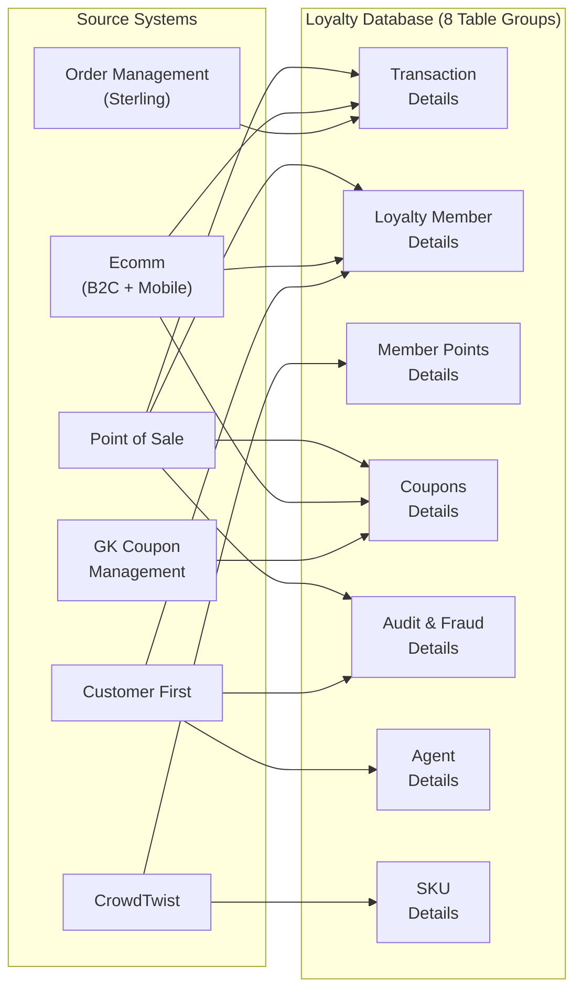

# Data Model — Approach, Assumptions & Migration Path

**Document Owner:** Data Architecture  
**Last Updated:** April 2026  
**Status:** Active POC — This document describes the placeholder schema we built, why it works, and how to transition to AAP's real Snowflake schema when it becomes available.

---

## 1. Origin & Source Material

We worked from **a single architecture diagram** provided by the AAP team showing six source systems feeding eight table groups into their Loyalty Database. We had:

- **One visual diagram** (screenshot) showing data flow from POS, Ecommerce, Sterling, Customer First, CrowdTwist, and GK Coupon Management
- **No column-level detail** (no DDL, no data dictionary)
- **No sample data or access to the actual database**
- **No information** about how AAP models cross-domain concepts (points tiers, coupon lifecycle, audit trails)

The AAP architecture diagram is reconstructed below as a data flow diagram showing the six source systems and eight table groups:



From this single diagram and domain knowledge, we inferred a reasonable schema suitable for the POC.

---

## 2. What We Built (POC Schema)

We created **10 Delta tables** in a Fabric Lakehouse using `notebooks/01-create-sample-data.py`. The tables are:

| Table | Rows | Description |
|---|---|---|
| `stores` | 500 | Store reference data (location, city, state) |
| `sku_reference` | 5,000 | Auto parts product catalog with category and pricing |
| `loyalty_members` | 50,000 | Member profiles, enrollment date, tier, opt-in status |
| `transactions` | 500,000 | 3 years of purchase and return transactions |
| `transaction_items` | ~1,500,000 | Line items per transaction (~3 items avg) |
| `member_points` | 500,000 | Points activity ledger (earn/redeem events) |
| `coupon_rules` | 100 | Campaign-aware coupon rule definitions |
| `coupons` | 200,000 | Coupon issuance and redemption tracking |
| `csr` | 500 | Customer Service Rep profiles and metadata |
| `csr_activities` | 50,000 | CSR audit trail (member lifecycle events, adjustments) |

**Data characteristics:**
- Date range: 2023-01-01 to 2026-04-01 (3+ years of activity)
- Deterministic generation (random seed = 42 for reproducibility)
- Realistic distributions: tier-correlated transaction frequency, seasonal patterns, category-specific margins, return rates
- ~2.8M total rows deployed in Lakehouse Delta format

**Key design choices:**
- Tier-linked behavior: Platinum members shop 3× more frequently than Bronze, redeem coupons at higher rates (55% vs. 25%), earn tier multipliers
- Campaign system: Named coupon campaigns with seasonal windows and tier-targeting
- Time-based correlation: Member enrollment date affects points accumulation, transaction recency affects coupon eligibility

---

## 3. How True We Stayed to the AAP Diagram

Below is an assessment comparing AAP's eight table groups to what we built:

| AAP Table Group | What We Built | Fidelity | Notes |
|---|---|---|---|
| **Transaction Details** | `transactions` + `transaction_items` | 🟢 High | Standard retail pattern; very likely to match AAP structure exactly |
| **Loyalty Member Details** | `loyalty_members` | 🟢 High | Core member profile, tier, enrollment date — fundamental to any loyalty system |
| **Member Points Details** | `member_points` | 🟡 Medium | Simple ledger with earn/redeem records; AAP uses CrowdTwist (external engine) which may differ |
| **Coupons Details** | `coupons` + `coupon_rules` | 🟡 Medium | Basic coverage; AAP's GK Coupon Management is a full system with complex rule engines |
| **Audit and Fraud Details** | `csr_activities` | 🟡 Medium | Partial coverage via CSR audit trail; missing fraud-specific fields and enrollment history |
| **Agent Details** | `csr` | 🟢 High | Simple reference table of customer service reps — unlikely to differ significantly |
| **SKU Details** | `sku_reference` | 🟡 Medium | Product catalog; AAP includes skip SKUs and bonus activity SKUs — we have generic product data |
| **Campaign Data** | `coupon_rules` (campaign-aware) | 🔴 Low | We embedded campaign concepts in coupon rules; AAP manages campaigns in CrowdTwist |

**Notable differences:**

- **ADDED:** `stores` table (500 store locations). The AAP diagram does not show a dedicated stores table, suggesting store data may be embedded in transaction records.
- **ADDED:** `transaction_items`. Standard retail pattern that AAP almost certainly has but wasn't explicitly shown in the high-level diagram.
- **NOT MODELED:** Comprehensive fraud domain. We track CSR activities but lack specialized fraud fields.
- **KNOWN GAP:** `loyalty_members` has no store linkage (enrollment_source tells HOW—POS or Ecomm—not WHERE). Real AAP schema likely includes store_id on enrollment.

---

## 4. Reasonableness Assessment

**High Confidence (will map easily to real schema):**
- Transactions: Purchases and returns are fundamental; our structure matches industry standard
- Members: Profile, tier, enrollment date are core to any loyalty system
- Stores: Even if embedded in transactions, the data concept is straightforward
- CSR/Agent data: Simple reference table, unlikely to vary significantly

**Medium Confidence (will need remapping):**
- Points/Tier (CrowdTwist is a full loyalty engine with campaign rules, bonus activities, tier multipliers—our simple ledger is a simplification)
- Coupons (GK Coupon Management is a sophisticated system; our rules/issuance model is basic)
- SKU Reference (AAP tracks skip SKUs and bonus-activity SKUs; we have generic products)

**Low Confidence (may require restructuring):**
- Campaign data (We assumed standalone tables; AAP uses CrowdTwist, so campaigns may be managed entirely outside the Loyalty Database)
- Rewards catalog (No explicit rewards table in AAP diagram; rewards may be managed in CrowdTwist as bonus activities)

**Overall:** The schema abstraction layer isolates risk. The consuming components (web app, Fabric Data Agent, API) do NOT depend on table or column names. They query through **contract views** (`v_member_summary`, `v_transaction_history`, etc.). When the real schema arrives:

1. Update the view definitions to query AAP's actual table names and columns
2. Test the views against real data
3. Everything downstream (web app, agents, API) works unchanged

The rework is limited to **four areas:**
- View layer SQL (in `docs/data-schema.md`)
- Semantic model table mappings (TMDL)
- Fabric Data Agent instruction sets
- Linguistic schema (table/column synonyms)

---

## 5. Schema Migration Prompts

When AAP provides their actual Snowflake schema, use these prompts **in order** to align the solution:

### Prompt 1: Schema Comparison and Mapping
**Input:** Paste AAP's actual Snowflake DDL (CREATE TABLE statements for all tables in the Loyalty Database)

**Task:**
```
Compare AAP's actual Snowflake schema to our placeholder schema documented in docs/data-schema.md §2.

For each of our 10 tables (stores, sku_reference, loyalty_members, transactions, 
transaction_items, member_points, coupon_rules, coupons, csr, csr_activities):

  1. Identify the corresponding AAP table(s) in the Snowflake schema
  2. Map our columns to AAP columns (if different names, note both)
  3. List columns we have that don't exist in AAP (candidates for removal)
  4. List AAP columns not in our placeholder (candidates for addition)
  5. Validate data types and nullability align

Output a mapping table showing:
| Placeholder Table | AAP Table | Column Mappings | Additions Needed | Columns to Drop |
| --- | --- | --- | --- | --- |

If a placeholder table has no correspondence in AAP (e.g., stores if not in Snowflake), 
note this as a schema gap and recommend next steps.
```

### Prompt 2: Semantic View Remapping
**Input:** The mapping table from Prompt 1

**Task:**
```
Using the mapping from Prompt 1, rewrite each of our 7 contract views to query AAP's 
actual Snowflake table and column names:

  - v_member_summary      (member profile + tier + points balance)
  - v_transaction_history (purchase/return history)
  - v_points_activity     (points earned/redeemed timeline)
  - v_reward_catalog      (available rewards + redemption stats)
  - v_store_performance   (store-level revenue, traffic, trending products)
  - v_campaign_effectiveness (campaign ROI, engagement, tier targeting)
  - v_product_popularity  (product sales by category, trending, inventory)

For each view:
  1. Rewrite the SQL SELECT and FROM clauses to use AAP table names
  2. Remap the WHERE, JOIN, and GROUP BY clauses to use AAP column names
  3. Keep the SELECT list column names EXACTLY as they are now (consuming components depend on these names)
  4. Update any business logic (e.g., tier classification, points accumulation) to match AAP's real calculations
  5. Test the rewritten view against the Snowflake schema to ensure it returns a valid result set

Output the new SQL for each view, suitable for deployment to the Snowflake environment.
```

### Prompt 3: Semantic Model Table Mappings (TMDL Update)
**Input:** Mapping table from Prompt 1 and updated views from Prompt 2

**Task:**
```
Update the Fabric semantic model (TMDL format) to reflect AAP's actual table schema.

For each of the 10 tables in the semantic model (defined in scripts/create-semantic-model.py):
  1. Verify the table name matches AAP's Snowflake table
  2. Update all column definitions (name, data type, format string) to match Snowflake
  3. Verify all relationships still hold (cardinality, join keys) with real column names
  4. Update DAX measures that reference columns that changed or were removed
  5. Add new measures if AAP schema includes new domains (e.g., fraud scoring)

Re-run the semantic model deployment script. Verify DirectLake refresh succeeds.
```

### Prompt 4: Linguistic Schema Update
**Input:** Mapping table from Prompt 1 and Prompt 3 TMDL updates

**Task:**
```
Update the linguistic schema (table synonyms, column synonyms, value synonyms, 
and AI instructions) to reflect AAP's real table and column names.

File: docs/linguistic-schema.md

For each changed table or column:
  1. Add synonyms that match AAP's terminology (both technical names and business names)
  2. Example: If AAP uses "customer_tier_code" instead of "tier", add the mapping:
     Column "tier" → synonyms: ["tier", "tier_code", "customer_tier_code", "membership_level"]
  3. Update AI instructions if AAP's data model differs (e.g., points calculation, tier rules)
  4. Validate that all 5 agent instruction files can still find their domain tables/columns

Re-deploy the linguistic schema to Fabric.
```

### Prompt 5: Fabric Data Agent Configuration Update
**Input:** Updated views, TMDL, and linguistic schema

**Task:**
```
Update the 5 Fabric Data Agent configurations to reference the new schema:

Agents to update:
  1. Crew Chief (executive orchestrator) — no table changes needed, but verify routing
  2. Pit Crew (CSR) — audit_trail/csr_activities may be restructured; verify column names
  3. GearUp (Loyalty) — member_points, loyalty_members column names; tier rules
  4. Ignition (Marketing) — coupons, campaigns; verify CrowdTwist integration if applies
  5. PartsPro (Merchandising) — sku_reference/products; pricing, category columns
  6. DieHard (Store Operations) — stores table or transaction store attributes; verify aggregations

For each agent:
  1. Verify the semantic model table references are correct
  2. Update sample queries to use real column names
  3. Update the instruction set to reflect AAP's business rules (e.g., "Gold tier is 30+ points")
  4. Test the agent against a real query to ensure SQL generation is correct

Output the updated configuration files ready for deployment.
```

### Prompt 6: Data Generation Sunset
**Input:** Mapping table and confirmation that AAP data is live in Snowflake

**Task:**
```
Document the transition from sample data to live data.

File: docs/data-approach.md §6 (this section)

For each of the 10 tables we generated:
  1. Confirm AAP's Snowflake table now provides the same or similar data
  2. Update Fabric Mirroring configuration to pull from Snowflake (instead of stopping at sample data)
  3. Stop running notebooks/01-create-sample-data.py (or reconfigure it for testing/demo scenarios only)
  4. Document the refresh cadence for each table (daily, hourly, real-time)
  5. Archive sample data notebook with a note on why it was deprecated

Update the data-schema.md document to reflect "This schema is now mirrored from AAP's Snowflake Loyalty Database."
```

### Prompt 7: Validation and Testing
**Input:** All updates from Prompts 1–6

**Task:**
```
Validate that the remapped solution is equivalent to the placeholder.

Write SQL queries that verify:
  1. v_member_summary returns 50K+ members with tier, points, enrollment dates
  2. v_transaction_history returns 500K+ transactions with dates, amounts, store info
  3. v_points_activity returns point earn/redeem events with dates and amounts
  4. v_product_popularity returns SKU sales performance by category
  5. v_store_performance returns store revenue and ranking
  6. v_campaign_effectiveness returns coupon campaign metrics
  7. v_audit_trail returns CSR/member lifecycle events (if added)

For each query:
  - Verify it runs without error
  - Verify it returns rows matching the expected data volumes
  - Verify the column names and types match the contract

Re-run the web app integration tests. Re-run agent sample queries. If all pass, 
the solution is ready for production deployment to AAP.
```

---

## 6. North Star

The goal is straightforward: AAP runs this demo on their own data.

**The flow:**
1. AAP's Snowflake Loyalty Database is mirrored to Fabric Lakehouse (via Fabric Mirroring)
2. The semantic model queries the Lakehouse tables through updated contract views
3. The Fabric Data Agent is configured with the real schema, linguistic synonyms, and domain-specific instructions
4. Users in AAP's marketing team open the "Advance Insights" web app and chat with the specialist agents
5. Each agent translates natural language to SQL, runs it against real AAP data, and returns results

The contract view architecture is the linchpin: consuming components (web app, agents, API) are already built and tested. Only the data layer changes. This separation of concerns means the POC schema proves the architecture works; transitioning to real data is a **data mapping exercise, not a code rewrite**.

---

## 7. Prerequisites for Phase B (Production Deployment)

When AAP is ready to transition from POC to production:

- [ ] **Snowflake schema** — DDL for all tables in the Loyalty Database (or data dictionary with column-level detail)
- [ ] **CrowdTwist integration** — How points, tiers, campaigns, and bonus activities are modeled (if not embedded in Loyalty DB)
- [ ] **Data access** — Snowflake connection string or Fabric Mirroring service principal and permissions
- [ ] **Data volumes** — Row counts per table and refresh cadence (daily, hourly, real-time?)
- [ ] **Store data** — Confirmation that store/location is tracked (dedicated table or attribute on transactions)
- [ ] **Audit/Fraud fields** — Confirmation of CSR/fraud-related columns for `v_audit_trail` mapping
- [ ] **Workspace capacity** — Confirmation of Fabric workspace and capacity allocation for Lakehouse mirroring and semantic model

---

**Document Status:** This is a living reference. It will be updated as AAP provides schema details and the migration is executed.
