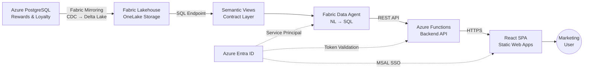
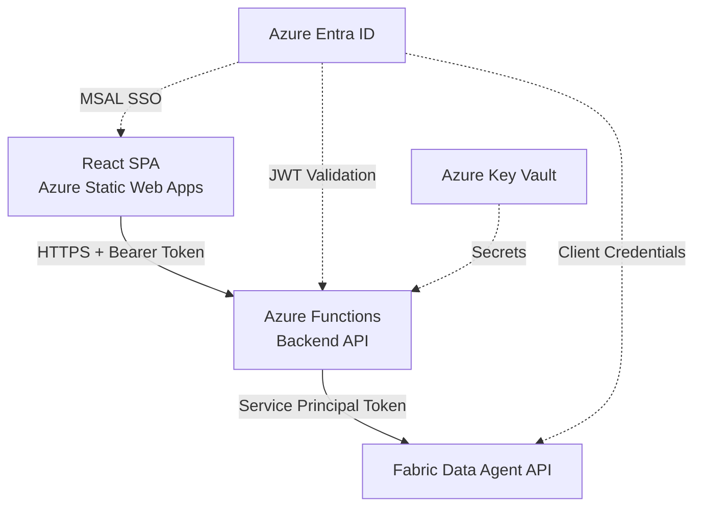

# AAP Data Agent POC — Implementation Plan

**Version:** 3.0  
**Date:** April 2026  
**Project:** Advanced Auto Parts Data Agent Proof of Concept  
**Status:** Architecture Complete | Implementation Ready

---

## Executive Summary

This plan describes the automation strategy and technical architecture for deploying the AAP Data Agent POC across four phases. Every provisioning step is scripted — Fabric REST API for workspace and data items, Azure CLI for identity and networking, Bicep for Azure infrastructure. No portal click-through is required; all automation lives in the project repository for repeatability and auditability.

**Active Work:** 3–5 days hands-on  
**Calendar Time:** 2–3 weeks (including wait for AAP prerequisites)

> Time estimates separate **active work** (hands-on-keyboard) from **wait time** (blocked on external approvals, provisioning delays, or data access).

---

## Solution Architecture



**Data flows left to right:** PostgreSQL data mirrors into a Fabric Lakehouse as Delta tables, exposed through semantic views that form a stable contract. The Data Agent reads those views to translate natural language into SQL. A backend API proxies agent requests with authentication. The React SPA provides a chat interface for marketing users.

**Identity flows top to bottom:** Azure Entra ID secures every layer — MSAL for user login, JWT validation at the API, and a service principal for Fabric access.

---

## Automation Strategy

All provisioning uses three automation surfaces:

| Surface | Used For | Auth Method |
|---------|----------|-------------|
| **Fabric REST API** (`api.fabric.microsoft.com/v1`) | Workspace, Lakehouse, mirrored database, Data Agent | Entra ID bearer token |
| **Azure CLI** (`az`) | Entra ID app registrations, PostgreSQL config, Key Vault, RBAC | Interactive login or service principal |
| **Bicep / ARM** (`infra/main.bicep`) | Static Web Apps, Functions, Key Vault, DNS | Azure CLI deployment |

Scripts authenticate via `az login` and acquire Fabric tokens with `az account get-access-token --resource https://api.fabric.microsoft.com`. All secrets are stored in Azure Key Vault — never in source control or environment variables.

---

## Phase 1: Fabric Workspace & Foundation

**Objective:** Provision a dedicated Fabric workspace with Lakehouse, service principal, and RBAC — the foundation for all subsequent phases.

**Active Work:** 2–4 hours | **Wait Time:** 0–2 days (Fabric tenant access) | **Owner:** Data Platform Team

### What Gets Created

```
AAP Fabric Tenant (existing)
└── Capacity: <assigned F64+>
    └── Workspace: AAP-RewardsLoyalty-POC
        └── Lakehouse: RewardsLoyaltyData
            ├── Schema: mirrored  (raw PostgreSQL replicas)
            └── Schema: semantic  (contract views)
```

**Workspace** — A dedicated Fabric workspace assigned to one of AAP's existing capacities (minimum F64 for Mirroring + Data Agent workloads). Recommend a non-production capacity to avoid impacting existing Power BI workloads.

**Lakehouse** — Chosen over Warehouse for three reasons: native mirroring integration writes directly to Lakehouse Delta tables; Delta Lake format handles schema evolution gracefully; and single-storage OneLake is cost-efficient. The SQL endpoint is enabled for Data Agent connectivity.

**Schema separation** — Two logical schemas isolate concerns. `mirrored` holds raw replicated tables (managed by Fabric Mirroring). `semantic` holds SQL views that define the query contract for all downstream consumers.

### Automation Approach

**`scripts/setup-workspace.ps1`** creates the workspace and Lakehouse using the Fabric REST API. It calls `POST /v1/workspaces` with display name, description, and capacity ID, then `POST /v1/workspaces/{id}/lakehouses` to create the data store. The script captures workspace and Lakehouse IDs for subsequent phases.

**`scripts/create-service-principal.sh`** provisions an Entra ID app registration via `az ad app create` and `az ad sp create`, assigns it Contributor role on the Fabric workspace, and stores the client secret in Key Vault via `az keyvault secret set`. This service principal is used by the backend API to call the Data Agent.

**Key API endpoints:**

- `POST /v1/workspaces` — Create workspace
- `POST /v1/workspaces/{id}/lakehouses` — Create Lakehouse
- `POST /v1/workspaces/{id}/roleAssignments` — Assign RBAC roles

### RBAC Model

| Role | Principal | Purpose |
|------|-----------|---------|
| Workspace Admin | Platform team | Provisioning, configuration |
| Workspace Member | Data engineers | Create/modify items |
| Workspace Contributor | Service principal | Data Agent access, read data |
| Workspace Viewer | Marketing users (via app) | Indirect access through web app |

### Prerequisites from AAP

- [ ] Fabric tenant access (Capacity Admin or Fabric Admin role)
- [ ] Decision on which existing capacity to assign
- [ ] Confirm workspace naming convention

### Validation Criteria

| Check | Method |
|-------|--------|
| Workspace exists and is accessible | `GET /v1/workspaces` returns workspace ID |
| Lakehouse created with SQL endpoint | `GET /v1/workspaces/{id}/lakehouses` shows `sqlEndpoint` property |
| Service principal can authenticate | Token acquisition succeeds for Fabric resource |
| RBAC assignments applied | `GET /v1/workspaces/{id}/roleAssignments` lists all principals |

---

## Phase 2: Data Mirroring & Schema Abstraction

**Objective:** Mirror PostgreSQL data into the Fabric Lakehouse, deploy a placeholder schema, and create the semantic view contract layer.

**Active Work:** 4–6 hours | **Wait Time:** 0–3 days (PostgreSQL access) | **Owner:** Data Engineer

### PostgreSQL Prerequisites

Fabric Mirroring uses PostgreSQL logical replication for change data capture. The source database must be configured before mirroring can start:

| Requirement | Detail |
|-------------|--------|
| **WAL level** | `wal_level = logical` (requires server restart on Azure PostgreSQL Flexible Server) |
| **Replication user** | Dedicated user with `SELECT` on target tables + `REPLICATION` attribute |
| **Network access** | Fabric mirroring engine must reach PostgreSQL — public endpoint with firewall rules or private endpoint with VNet peering |
| **PostgreSQL version** | v11+ recommended; Flexible Server preferred |
| **Publication** | Logical replication publication for selected tables |

### How Fabric Mirroring Works

```
PostgreSQL                          Fabric Lakehouse
┌──────────────┐                   ┌──────────────────┐
│ Source Tables │──── Logical ────→│ mirrored.members  │
│              │  Replication       │ mirrored.txns     │
│ WAL Stream   │──── CDC ────────→│ mirrored.rewards   │
│              │  (incremental)    │ (Delta Lake format)│
└──────────────┘                   └──────────────────┘
         │                                   │
    Initial snapshot                  Near-real-time
    (full table copy)                 updates (seconds
                                      to minutes)
```

**Connection setup:** Provide PostgreSQL connection string, credentials, and select tables to mirror.  
**Initial snapshot:** Full copy of selected tables into Lakehouse Delta format.  
**CDC (Change Data Capture):** Ongoing incremental sync captures inserts, updates, and deletes via PostgreSQL logical replication.  
**Schema detection:** DDL changes (add/drop columns) are detected and propagated to Delta tables automatically.

Mirroring is a fully managed Fabric service — no custom ETL code, no pipeline orchestration.

### Placeholder Schema

Since the production AAP rewards/loyalty schema is not yet available, we deploy a realistic placeholder with 9 tables across 5 domains:

| Domain | Tables | Purpose |
|--------|--------|---------|
| Customer/Member | `members`, `member_tiers` | Loyalty members, tier definitions |
| Transaction | `transactions`, `transaction_items` | Purchase history, line items |
| Points/Rewards | `points_ledger`, `rewards`, `reward_redemptions` | Points activity, catalog, redemptions |
| Product/Store | `products`, `stores` | Product catalog, store locations |
| Campaign | `campaigns`, `campaign_responses` | Marketing campaigns, member engagement |

**`scripts/deploy-placeholder-schema.sh`** creates these tables in PostgreSQL and loads sample data (~50K members, ~500K transactions) with realistic distributions for meaningful Data Agent testing. Full DDL and entity relationships are documented in `docs/data-schema.md`.

### Semantic Views — The Contract Layer

This is the architectural keystone of the POC. All downstream consumers (Data Agent, API, reports) query semantic views, never raw mirrored tables.

```
mirrored.members ──┐
mirrored.member_tiers ──┤──→ v_member_summary
mirrored.points_ledger ─┘      (contract view)
                                    │
                            ┌───────┴───────┐
                            │               │
                       Data Agent      Power BI
                       (NL → SQL)      (reports)
```

**7 contract views** provide stable query surfaces:

| View | Joins | Purpose |
|------|-------|---------|
| `v_member_summary` | members + tiers + points | Member profile with current balance |
| `v_transaction_history` | transactions + members + stores + items | Enriched purchase records |
| `v_points_activity` | points_ledger + members + tiers | Points earn/redeem timeline |
| `v_reward_redemptions` | redemptions + rewards + members | Redemption history |
| `v_campaign_performance` | campaigns + responses (aggregated) | Campaign effectiveness metrics |
| `v_product_sales` | transaction_items + products + categories | Product performance |
| `v_store_performance` | transactions + stores (aggregated) | Store-level metrics |

**`scripts/create-semantic-views.sql`** contains the DDL for all 7 views. Each view includes column aliases, computed fields (e.g., `days_since_last_purchase`), and joins that flatten the normalized schema into analysis-friendly shapes.

### Automation Approach

**`scripts/configure-postgres.sh`** sets WAL parameters via `az postgres flexible-server parameter set`, creates the replication user, and configures firewall rules to allow Fabric access.

**`scripts/setup-mirroring.ps1`** creates the Fabric mirrored database item via `POST /v1/workspaces/{id}/mirroredDatabases`, configures the PostgreSQL connection, selects tables, and initiates the initial snapshot.

**Key API endpoints:**

- `POST /v1/workspaces/{id}/mirroredDatabases` — Create mirrored database
- `GET /v1/workspaces/{id}/mirroredDatabases/{id}/getStatus` — Monitor sync status

### Prerequisites from AAP

- [ ] PostgreSQL connection string and credentials
- [ ] Network access confirmed (firewall rules or private endpoint)
- [ ] `wal_level = logical` enabled (requires server restart)
- [ ] Approval for replication user creation

### Validation Criteria

| Check | Method |
|-------|--------|
| Mirroring status is "Running" | Mirrored database status API returns active |
| All tables replicated | Row counts in Lakehouse match PostgreSQL source |
| CDC working | Insert a test row in PostgreSQL; confirm it appears in Lakehouse within minutes |
| Semantic views queryable | `SELECT TOP 10 * FROM v_member_summary` returns data via SQL endpoint |

---

## Phase 3: Fabric Data Agent

**Objective:** Deploy and configure a Fabric Data Agent that translates natural language questions into accurate SQL against the semantic views.

**Active Work:** 4–6 hours | **Wait Time:** 0–1 day | **Owner:** Data Engineer + Architect

### What Is a Fabric Data Agent?

A Fabric Data Agent is an AI-powered natural language interface to structured data. It uses Azure OpenAI GPT models to translate user questions into SQL, executes those queries against a Fabric Lakehouse or Warehouse SQL endpoint, and returns results in conversational format.

**Architecture:**

```
User Question                    Data Agent                        Lakehouse
"How many gold                ┌──────────────┐               ┌──────────────┐
 customers?"    ──────────→   │ 1. Parse     │               │              │
                              │ 2. Map to    │──── SQL ────→ │ SQL Endpoint │
                              │    schema    │               │ (semantic    │
                              │ 3. Generate  │←── Results ── │  views)      │
                              │    SQL       │               │              │
  "10,234 gold  ←──────────   │ 4. Execute   │               └──────────────┘
   customers"                 │ 5. Format    │
                              └──────────────┘
```

**How NL→SQL works internally:**

1. **Intent recognition** — Parse the question, identify aggregation type, filters, entities
2. **Schema mapping** — Match natural language terms to table/column names using descriptions and sample queries
3. **SQL generation** — Construct a query scoped to `semantic.*` views with proper filters, joins, and aggregations
4. **Validation** — Verify read-only (no mutations), apply timeout (30s), enforce row limit (1,000)
5. **Execution** — Run SQL against the Lakehouse SQL endpoint
6. **Response formatting** — Return natural language answer + generated SQL for transparency

### Configuration Components

The Data Agent is configured through three artifacts stored in source control:

**`config/data-agent-instructions.md`** — System prompt that grounds the agent with domain knowledge: loyalty tier definitions (Bronze < $500, Silver $500–$1,500, Gold > $1,500), default date ranges, PII handling rules, and business terminology. This is the primary lever for accuracy tuning.

**`config/sample-queries.json`** — Representative question→SQL pairs that teach the agent query patterns. Covers single-table aggregations, multi-table joins, date filtering, tier segmentation, and campaign analytics. 20+ examples across all 7 contract views.

**`config/fabric-workspace-config.json`** — Runtime configuration: workspace ID, Lakehouse ID, SQL endpoint URL, service principal details. Referenced by scripts and the backend API.

### Automation Approach

**`scripts/configure-data-agent.ps1`** creates the Data Agent item via `POST /v1/workspaces/{id}/dataAgents`, attaches it to the Lakehouse SQL endpoint, uploads system instructions and sample queries, and configures the schema scope to `semantic` views only.

**`scripts/test-data-agent.py`** is a Python test harness that runs a battery of sample questions against the Data Agent API and validates SQL correctness. It reports accuracy rate, response times, and any failures for tuning.

**Key API endpoints:**

- `POST /v1/workspaces/{id}/dataAgents` — Create Data Agent
- `POST /v1/workspaces/{id}/dataAgents/{id}/query` — Execute NL query
- `PATCH /v1/workspaces/{id}/dataAgents/{id}` — Update configuration

### Accuracy Tuning Strategy

Data Agent accuracy depends heavily on instruction quality and sample query coverage. The tuning loop:

1. Run test harness with baseline sample queries
2. Identify failure patterns (ambiguous terms, missing joins, wrong date logic)
3. Add targeted sample queries and instruction clarifications
4. Re-run test harness; iterate until >90% accuracy on test set
5. Validate with real user questions gathered from AAP marketing team

**Common failure patterns and mitigations:**

| Pattern | Example | Mitigation |
|---------|---------|------------|
| Ambiguous date ranges | "last month" = calendar month or trailing 30 days? | Define defaults in system instructions |
| Complex joins (3+ tables) | "Top products bought by gold customers in Q1" | Pre-define common multi-table joins in sample queries |
| Business jargon | "churn rate", "LTV" | Map domain terms to SQL patterns in instructions |
| Aggregation ambiguity | "average spend" = per customer or per transaction? | Include clarifying examples for common metrics |

### Limitations & Guardrails

The Data Agent operates within defined safety boundaries:

- **Read-only enforcement** — No INSERT, UPDATE, DELETE, or DROP statements generated
- **Query timeout** — 30-second limit prevents runaway queries
- **Row limit** — Maximum 1,000 rows returned per query
- **Schema scope** — Agent only sees `semantic` schema views, not raw `mirrored` tables
- **PII protection** — System instructions prohibit returning raw email addresses or phone numbers
- **Audit logging** — All queries logged in Fabric for compliance review

### Prerequisites from AAP

- [ ] Phase 2 complete (mirrored data available in Lakehouse)
- [ ] Sample business questions from marketing team (10–20 real-world queries)
- [ ] Confirmation on PII handling rules (what can/cannot be returned)

### Validation Criteria

| Check | Method |
|-------|--------|
| Agent responds to NL queries | Test harness returns results for all sample questions |
| SQL targets semantic views only | Generated SQL contains `semantic.` or `v_` prefixes, never `mirrored.` |
| Accuracy ≥ 90% on test set | Test harness reports pass rate |
| Response time < 5 seconds | Test harness measures P95 latency |
| PII rules enforced | Agent does not return raw email/phone in test responses |

---

## Phase 4: Web Application

**Objective:** Build a lightweight web app that exposes the Data Agent to marketing users with SSO authentication and a chat-like interface.

**Active Work:** 1–2 days | **Wait Time:** 0–2 days (Entra ID app registration) | **Owner:** Application Developer

### Architecture Overview



The web application is a React single-page application hosted on Azure Static Web Apps with a managed Azure Functions backend. Users authenticate via MSAL (Microsoft Authentication Library) for SSO against AAP's Entra ID tenant. The backend validates tokens, proxies queries to the Data Agent using a service principal, and returns results. All Azure infrastructure is defined in Bicep for repeatable deployment.

**Key components:**
- **Frontend:** React SPA with chat interface, query history, SQL transparency panel
- **Backend:** Azure Functions (`POST /api/query`, `GET /api/health`) — authenticates users, proxies to Data Agent
- **Auth:** Two Entra ID app registrations (SPA + API), service principal for Fabric access
- **Secrets:** Key Vault stores service principal credentials, referenced by Functions app settings
- **Deployment:** `infra/main.bicep` provisions all Azure resources; CI/CD via GitHub Actions

> **Phase 4 is high-level by design.** Detailed frontend component design, API implementation, and UX decisions will be documented in a Phase 4 design document when we begin active development. The architecture above establishes the deployment topology and integration contracts.

**`scripts/register-entra-apps.sh`** creates SPA and API app registrations via `az ad app create`.  
**`scripts/deploy.sh`** wraps Bicep deployment + application code deployment.  
**`infra/main.bicep`** defines Static Web App, Functions, Key Vault, and DNS resources.

---

## Schema Swap Procedure

When AAP provides the production rewards/loyalty schema, the semantic view contract layer enables a zero-code-change migration.

### Conceptual Approach

```
BEFORE (Placeholder)                    AFTER (Production)
─────────────────────                   ──────────────────
v_member_summary                        v_member_summary
  → SELECT FROM mirrored.members          → SELECT FROM mirrored.aap_customers
  → JOIN mirrored.member_tiers             → JOIN mirrored.aap_loyalty_tiers
  → JOIN mirrored.points_ledger            → JOIN mirrored.aap_points

Same view name, same output columns, different source tables.
Data Agent, API, and web app are unchanged.
```

### Procedure

1. **Schema analysis** — Map production tables/columns to existing contract view outputs. Identify gaps (new fields to expose, missing relationships).

2. **View remapping** — Rewrite view DDL to SELECT from new mirrored tables with appropriate column aliases. The output column names stay identical. Script: `scripts/schema-swap.ps1`.

3. **Mirroring update** — Reconfigure Fabric Mirroring to sync production tables instead of placeholder tables.

4. **Sample query update** — Add production-relevant sample queries to `config/sample-queries.json`. Adjust Data Agent instructions for any new business terminology.

5. **Regression testing** — Run the test harness (`scripts/test-data-agent.py`) against all existing questions. Every query that worked with placeholder data must still work with production data.

6. **Cutover** — Deploy updated views, mirroring config, and agent instructions in a single coordinated change. Validate end-to-end from web app.

**Estimated effort:** 4–8 hours active work for the data engineer. **Code changes required in app or API:** Zero.

### What Changes vs. What Stays the Same

| Component | Changes? | Detail |
|-----------|----------|--------|
| Fabric Mirroring | **Yes** | Reconfigure to sync production tables |
| Semantic views (DDL) | **Yes** | Remap SELECT sources and column aliases |
| Sample queries | **Yes** | Add production-relevant examples |
| Data Agent instructions | **Minor** | Update business terminology if needed |
| Data Agent item | **No** | Same agent, same API endpoint |
| Backend API code | **No** | Proxies to same Data Agent |
| React web app | **No** | Displays same response format |
| Entra ID config | **No** | Same auth flow |
| Bicep infrastructure | **No** | Same Azure resources |

---

## Phase Dependencies & Sequencing

```mermaid
gantt
    title Phase Execution Timeline
    dateFormat  X
    axisFormat %s

    section Foundation
    Phase 1 - Workspace & Lakehouse    :p1, 0, 4
    Service Principal & RBAC            :p1b, 0, 2

    section Data Layer
    PostgreSQL Config (AAP wait)        :crit, wait1, 2, 5
    Phase 2 - Mirroring & Schema        :p2, after wait1, 8
    Semantic Views                       :p2b, after p2, 2

    section Intelligence
    Phase 3 - Data Agent                :p3, after p2b, 6
    Accuracy Tuning                     :p3b, after p3, 4

    section Application
    Phase 4 - Web App                   :p4, after p1b, 12
    Integration Testing                 :test, after p3b, 4
```



**Parallelism opportunities:**
- Phase 1 (workspace) and Phase 4 (web app scaffolding) can start simultaneously
- Entra ID app registrations (Phase 4 prereq) can run during Phase 1
- Data Agent instruction authoring can begin before Phase 2 completes

**Blocking dependencies:**
- Phase 2 requires Phase 1 (Lakehouse must exist)
- Phase 3 requires Phase 2 (mirrored data must be queryable)
- Integration testing requires Phases 1–4 all complete
- PostgreSQL access is the critical path — delays here push the entire timeline

---

## Scripts Inventory

| Script | Purpose |
|--------|---------|
| `scripts/setup-workspace.ps1` | Creates Fabric workspace, Lakehouse, and role assignments via REST API |
| `scripts/create-service-principal.sh` | Provisions Entra ID app registration + service principal, stores secrets in Key Vault |
| `scripts/configure-postgres.sh` | Sets PostgreSQL WAL parameters, creates replication user, configures firewall |
| `scripts/setup-mirroring.ps1` | Creates Fabric mirrored database item and initiates sync |
| `scripts/deploy-placeholder-schema.sh` | Deploys placeholder tables and sample data to PostgreSQL |
| `scripts/create-semantic-views.sql` | SQL DDL for all 7 semantic contract views |
| `scripts/configure-data-agent.ps1` | Creates and configures Fabric Data Agent via REST API |
| `scripts/test-data-agent.py` | Test harness — runs sample queries, reports accuracy and latency |
| `scripts/register-entra-apps.sh` | Creates SPA and API app registrations in Entra ID |
| `scripts/deploy.sh` | End-to-end Azure deployment (wraps Bicep + app deploy) |
| `scripts/schema-swap.ps1` | Orchestrates production schema cutover (view remap + mirroring update) |
| `infra/main.bicep` | Bicep template for Static Web App, Functions, Key Vault |
| `config/data-agent-instructions.md` | Data Agent system prompt with domain knowledge and rules |
| `config/sample-queries.json` | Sample NL→SQL pairs for agent training |
| `config/fabric-workspace-config.json` | Runtime configuration (workspace IDs, endpoints, principal info) |

---

## Risk Register

| # | Risk | Impact | Likelihood | Mitigation |
|---|------|--------|------------|------------|
| 1 | **PostgreSQL network access delayed** | Blocks Phase 2 entirely | Medium | Start Phases 1 and 4 in parallel; test mirroring with a temporary PostgreSQL instance |
| 2 | **Schema mismatch** — placeholder diverges significantly from production | Rework views and sample queries | Medium | Contract layer isolates changes to view DDL only; no app/agent code changes |
| 3 | **Data Agent accuracy** — generates incorrect SQL | User trust erosion | Medium | Comprehensive sample queries, iterative tuning, display SQL for verification |
| 4 | **Fabric capacity contention** — POC impacts existing PBI workloads | Performance degradation for AAP | Low | Use non-production capacity; monitor CU utilization; scale if needed |
| 5 | **Entra ID integration complexity** — multi-tenant or conditional access policies | Delays Phase 4 auth | Low | Test service principal auth early in Phase 1; document required Entra ID config for AAP |
| 6 | **Data Agent API changes** — Fabric Data Agent is in preview | Breaking changes during POC | Low | Pin to specific API version; monitor Fabric release notes; abstract agent calls behind backend API |
| 7 | **PII exposure** — agent returns sensitive customer data | Compliance risk | Medium | PII rules in system instructions; column-level masking in views; review with AAP security |

---

## Timeline Summary

| Phase | Description | Active Work | Wait Time | Calendar |
|-------|-------------|-------------|-----------|----------|
| **1** | Workspace, Lakehouse, service principal | 2–4 hours | 0–2 days | 1–2 days |
| **2** | PostgreSQL mirroring, placeholder schema, views | 4–6 hours | 0–3 days | 1–4 days |
| **3** | Data Agent configuration and accuracy tuning | 4–6 hours | 0–1 day | 1–2 days |
| **4** | Web app development and deployment | 1–2 days | 0–2 days | 2–4 days |
| **Swap** | Production schema cutover | 4–8 hours | 0–2 days | 1–3 days |
| **Total** | — | **3–5 days** | — | **2–3 weeks** |

Calendar time is dominated by wait for AAP prerequisites: Fabric capacity access, PostgreSQL credentials, Entra ID permissions, and production schema availability. Active work can compress significantly if access is pre-staged.

---

## Prerequisites Summary

Complete list of what AAP must provide, organized by phase:

| Prereq | Phase | Blocking? |
|--------|-------|-----------|
| Fabric tenant access (Capacity Admin role) | 1 | Yes |
| Capacity assignment decision | 1 | Yes |
| PostgreSQL connection string + credentials | 2 | Yes |
| Network access to PostgreSQL (firewall or private endpoint) | 2 | Yes |
| `wal_level = logical` enabled | 2 | Yes |
| Sample business questions from marketing team | 3 | No (nice to have) |
| PII handling rules confirmed | 3 | No (can default to restrictive) |
| Entra ID app registration permissions | 4 | Yes |
| Custom domain (optional) | 4 | No |
| Production rewards/loyalty schema | Swap | Yes |

---

## Success Criteria

The POC is successful when:

- [ ] Marketing users can ask 10+ different questions in plain English and get accurate results
- [ ] Data Agent generates correct SQL with >90% accuracy on the test set
- [ ] Query results return within 5 seconds (P95)
- [ ] System supports 5+ concurrent users without degradation
- [ ] Production schema integration verified end-to-end (when schema available)
- [ ] AAP stakeholders approve for next phase (production deployment planning)

---

## Monitoring & Observability

Post-deployment, the following metrics should be tracked to ensure POC health:

| Metric | Source | Alert Threshold |
|--------|--------|-----------------|
| Mirroring latency | Fabric mirrored database status | > 15 minutes behind |
| Data Agent response time | Backend API logs | P95 > 5 seconds |
| Query accuracy (user feedback) | App feedback mechanism | < 85% satisfaction |
| Capacity utilization | Fabric capacity metrics | > 80% sustained CU usage |
| Auth failures | Entra ID sign-in logs | > 5% failure rate |
| API error rate | Azure Functions metrics | > 2% 5xx responses |

Fabric provides built-in monitoring for mirroring sync status, capacity utilization, and query performance. The backend API should log all queries (question text, generated SQL, response time, success/failure) for accuracy analysis and debugging.

---

## References

- **`docs/architecture.md`** — Complete technical architecture, component specifications, security model
- **`docs/data-schema.md`** — Placeholder schema DDL, entity relationships, contract view definitions
- **`docs/overview.md`** — Executive summary for stakeholders

---

**Document Owner:** Microsoft Field Team  
**Last Updated:** April 2026
