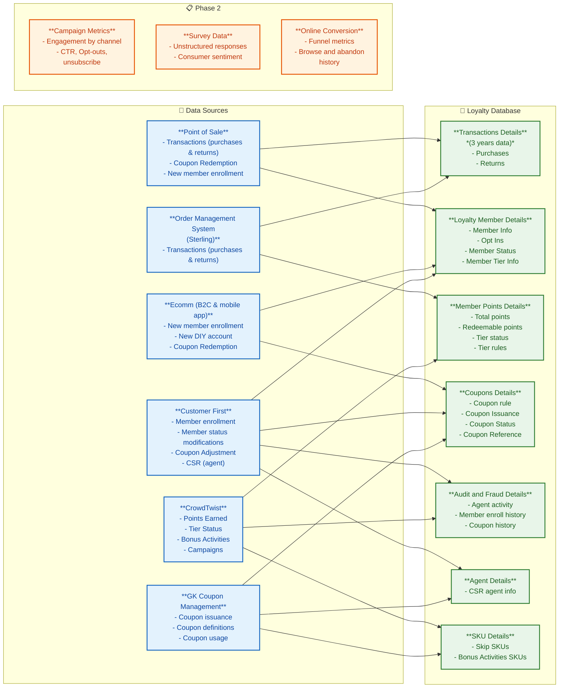

# AAP Loyalty Data Architecture

## Reading This Diagram

| Column | Description |
|--------|-------------|
| **Data Sources** | Upstream systems feeding loyalty data |
| **Loyalty Database** | Consolidated loyalty data store (target for Fabric mirroring) |
| **Phase 2** | Future data sources not yet in scope |

> **Viewing:** This renders natively on GitHub. In VS Code, install the
> [Markdown Preview Mermaid Support](https://marketplace.visualstudio.com/items?itemName=bierner.markdown-mermaid) extension,
> then open Markdown Preview (`Ctrl+Shift+V`).
