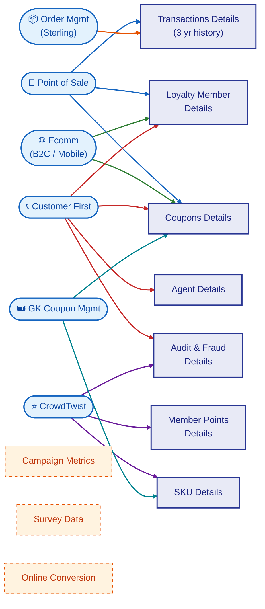

# AAP Loyalty Data Architecture

## Source → Loyalty Database Mapping

Each data source feeds specific entity groups in the loyalty database. Lines are color-coded by source system; connections converge through a central integration layer (likely external SQL links or ETL pipelines).

| Data Source | Data Elements | → Loyalty DB Entity | Rationale |
|---|---|---|---|
| **Point of Sale** | Transactions (purchases & returns) | **Transactions Details** | POS purchase/return records |
| **Point of Sale** | New member enrollment | **Loyalty Member Details** | In-store enrollment |
| **Point of Sale** | Coupon Redemption | **Coupons Details** | Coupon scans at checkout |
| **Order Mgmt (Sterling)** | Transactions (purchases & returns) | **Transactions Details** | Order fulfillment records |
| **Ecomm (B2C/mobile)** | New member enrollment, New DIY account | **Loyalty Member Details** | Online enrollment and DIY accounts |
| **Ecomm (B2C/mobile)** | Coupon Redemption | **Coupons Details** | Online coupon redemptions |
| **Customer First** | Member enrollment, status modifications | **Loyalty Member Details** | CRM manages member lifecycle |
| **Customer First** | Coupon Adjustment | **Coupons Details** | Service agents adjust coupons |
| **Customer First** | CSR (agent) | **Agent Details** | CSR representative records |
| **Customer First** | All agent/member/coupon activity | **Audit and Fraud Details** | CRM audit trail |
| **CrowdTwist** | Points Earned, Tier Status | **Member Points Details** | Loyalty engine — points & tiers |
| **CrowdTwist** | Bonus Activities | **SKU Details** | Bonus activity SKU configs |
| **CrowdTwist** | Points/tier change history | **Audit and Fraud Details** | Activity tracked for fraud detection |
| **GK Coupon Mgmt** | Coupon issuance, definitions, usage | **Coupons Details** | Coupon platform rules & status |
| **GK Coupon Mgmt** | SKU-level coupon rules | **SKU Details** | Product-level coupon rules |

## Architecture Diagram

**Legend:** 🔵 POS &nbsp; 🟠 OMS &nbsp; 🟢 Ecomm &nbsp; 🔴 Customer First &nbsp; 🟣 CrowdTwist &nbsp; 🔷 GK Coupon

**Phase 2** (dashed) sources are not yet integrated: Campaign Metrics, Survey Data, Online Conversion.

## Reading This Diagram

| Column | Description |
|--------|-------------|
| **Data Sources** | Upstream systems feeding loyalty data |
| **Loyalty Database** | Consolidated loyalty data store (target for Fabric mirroring) |
| **Phase 2** | Future data sources not yet in scope |

> **Viewing:** This renders natively on GitHub. In VS Code, install the
> [Markdown Preview Mermaid Support](https://marketplace.visualstudio.com/items?itemName=bierner.markdown-mermaid) extension,
> then open Markdown Preview (`Ctrl+Shift+V`).
