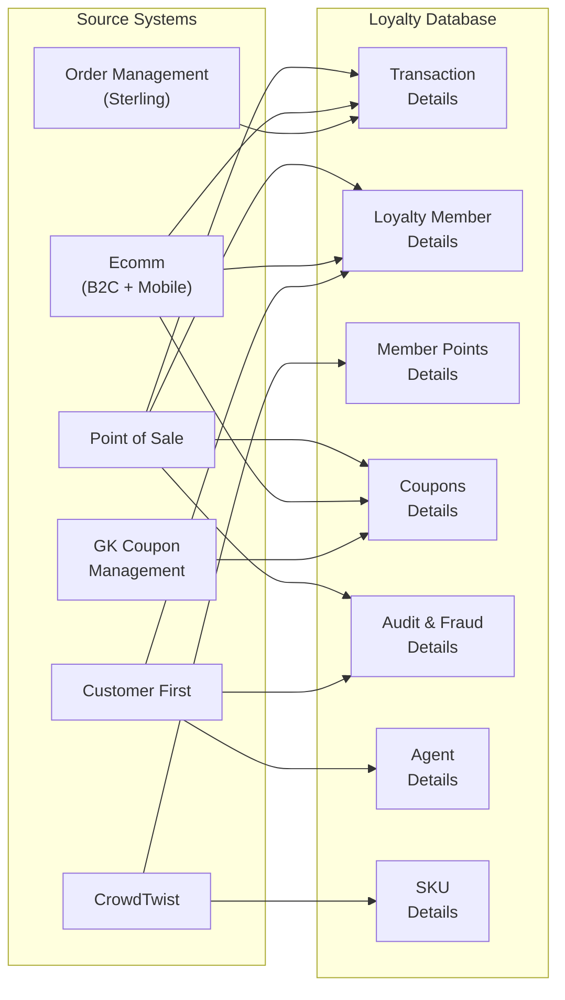

# Production Schema Migration — AAP Loyalty Database

**Document Owner:** Data Architecture  
**Last Updated:** July 2026  
**Status:** ACTIVE REFERENCE — Guides transition from POC placeholder to real AAP data

---

## Context

This document synthesizes two prior analyses:
- **data-approach.md** — Why we built a placeholder schema, how it differs from real AAP data, and the schema swap procedure
- **aap-schema-reference.md** — Preliminary mapping of real AAP tables to our semantic contract layer

**Purpose:** Provide a single authoritative guide for transitioning from synthetic POC data to production AAP Snowflake data when it becomes available.

---

## Part 1: Understanding the Real AAP Loyalty Database

### 1.1 Source Systems

AAP's Loyalty Database is fed by **six distinct source systems**, each responsible for specific data domains:

| # | Source System | Key Data Feeds |
|---|---|---|
| 1 | **Point of Sale (POS)** | Transactions (purchases/returns), coupon redemption, new member enrollment |
| 2 | **Ecomm** (B2C + mobile app) | New member enrollment, new DIY account creation, coupon redemption |
| 3 | **Order Management System (Sterling)** | Transactions (purchases and returns) |
| 4 | **Customer First** | Member enrollment, member status modifications, coupon adjustments, CSR agent info |
| 5 | **CrowdTwist** | Points earned, tier status, bonus activities, campaigns |
| 6 | **GK Coupon Management** | Coupon issuance, coupon definitions, coupon usage |

### 1.2 Loyalty Database Table Groups

The Loyalty Database contains **8 core table groups**:

| # | Table Group | Known Fields / Content | Primary Source(s) |
|---|---|---|---|
| 1 | **Transaction Details** | Purchases, returns (3 years retention) | POS, Sterling, Ecomm |
| 2 | **Loyalty Member Details** | Member info, opt-ins, member status, member tier info | POS, Ecomm, Customer First |
| 3 | **Member Points Details** | Total points, redeemable points, tier status, tier rules | CrowdTwist |
| 4 | **Coupons Details** | Coupon rules, coupon issuance, coupon status, coupon reference | GK Coupon Mgmt, POS, Ecomm |
| 5 | **Audit and Fraud Details** | Agent activity, member enrollment history, coupon history | Customer First, POS |
| 6 | **Agent Details** | CSR agent info | Customer First |
| 7 | **SKU Details** | Skip SKUs, bonus activities, SKU reference | CrowdTwist, POS |
| 8 | *(Campaign-adjacent via CrowdTwist)* | Bonus activities, campaigns | CrowdTwist |

> **Note:** Table #8 (Campaigns) is inferred. CrowdTwist feeds campaign/bonus data but may not present a distinct table in Snowflake. Clarification needed from AAP.

### 1.3 Data Flow Diagram



---

## Part 2: POC Schema vs. Production Reality

### 2.1 What We Built (POC Placeholder)

We created a **10-table Delta schema** in the Fabric Lakehouse using `notebooks/01-create-sample-data.py`:

| Table | Rows | Description |
|---|---|---|
| `stores` | 500 | Store reference data (location, city, state) |
| `sku_reference` | 5,000 | Auto parts product catalog with category and pricing |
| `loyalty_members` | 50,000 | Member profiles, enrollment date, tier, opt-in status |
| `transactions` | 500,000 | 3 years of purchase and return transactions |
| `transaction_items` | ~1,500,000 | Line items per transaction (~3 items avg) |
| `member_points` | 500,000 | Points activity ledger (earn/redeem events) |
| `coupon_rules` | 100 | Campaign-aware coupon rule definitions |
| `coupons` | 200,000 | Coupon issuance and redemption tracking |
| `csr` | 500 | Customer Service Rep profiles and metadata |
| `csr_activities` | 50,000 | CSR audit trail (member lifecycle events, adjustments) |

**Data characteristics:**
- Date range: 2023-01-01 to 2026-04-01 (3+ years of activity)
- Deterministic generation (random seed = 42 for reproducibility)
- Realistic distributions: tier-correlated transaction frequency, seasonal patterns, category-specific margins, return rates
- ~2.8M total rows deployed in Lakehouse Delta format

**Key design choices:**
- Tier-linked behavior: Platinum members shop 3× more frequently than Bronze, redeem coupons at higher rates (55% vs. 25%), earn tier multipliers
- Campaign system: Named coupon campaigns with seasonal windows and tier-targeting
- Time-based correlation: Member enrollment date affects points accumulation, transaction recency affects coupon eligibility

### 2.2 How We Mapped to AAP's Eight Table Groups

Below is an assessment comparing AAP's eight table groups to what we built:

| AAP Table Group | What We Built | Fidelity | Notes |
|---|---|---|---|
| **Transaction Details** | `transactions` + `transaction_items` | 🟢 High | Standard retail pattern; very likely to match AAP structure exactly |
| **Loyalty Member Details** | `loyalty_members` | 🟢 High | Core member profile, tier, enrollment date — fundamental to any loyalty system |
| **Member Points Details** | `member_points` | 🟡 Medium | Simple ledger with earn/redeem records; AAP uses CrowdTwist (external engine) which may differ |
| **Coupons Details** | `coupons` + `coupon_rules` | 🟡 Medium | Basic coverage; AAP's GK Coupon Management is a full system with complex rule engines |
| **Audit and Fraud Details** | `csr_activities` | 🟡 Medium | Partial coverage via CSR audit trail; missing fraud-specific fields and enrollment history |
| **Agent Details** | `csr` | 🟢 High | Simple reference table of customer service reps — unlikely to differ significantly |
| **SKU Details** | `sku_reference` | 🟡 Medium | Product catalog; AAP includes skip SKUs and bonus activity SKUs — we have generic product data |
| **Campaign Data** | `coupon_rules` (campaign-aware) | 🔴 Low | We embedded campaign concepts in coupon rules; AAP manages campaigns in CrowdTwist |

**Notable differences:**

- **ADDED:** `stores` table (500 store locations). The AAP diagram does not show a dedicated stores table, suggesting store data may be embedded in transaction records.
- **ADDED:** `transaction_items`. Standard retail pattern that AAP almost certainly has but wasn't explicitly shown in the high-level diagram.
- **NOT MODELED:** Comprehensive fraud domain. We track CSR activities but lack specialized fraud fields.
- **KNOWN GAP:** `loyalty_members` has no store linkage (enrollment_source tells HOW—POS or Ecomm—not WHERE). Real AAP schema likely includes store_id on enrollment.

### 2.3 Reasonableness Assessment

**High Confidence (will map easily to real schema):**
- Transactions: Purchases and returns are fundamental; our structure matches industry standard
- Members: Profile, tier, enrollment date are core to any loyalty system
- Stores: Even if embedded in transactions, the data concept is straightforward
- CSR/Agent data: Simple reference table, unlikely to vary significantly

**Medium Confidence (will need remapping):**
- Points/Tier (CrowdTwist is a full loyalty engine with campaign rules, bonus activities, tier multipliers—our simple ledger is a simplification)
- Coupons (GK Coupon Management is a sophisticated system; our rules/issuance model is basic)
- SKU Reference (AAP tracks skip SKUs and bonus-activity SKUs; we have generic products)

**Low Confidence (may require restructuring):**
- Campaign data (We assumed standalone tables; AAP uses CrowdTwist, so campaigns may be managed entirely outside the Loyalty Database)
- Rewards catalog (No explicit rewards table in AAP diagram; rewards may be managed in CrowdTwist as bonus activities)

---

## Part 3: Schema Abstraction Isolates Risk

### 3.1 The Contract View Layer

The system does NOT depend on specific table names or column names. Instead, all consuming components (Fabric Data Agent, Backend API, Web App) query through **contract views**:

| Contract View | Purpose | Key Consumers |
|---|---|---|
| `v_member_summary` | Member profile + tier + points balance | Data Agent, Web App, API |
| `v_transaction_history` | Enriched transactions with member/store context | Data Agent, Web App |
| `v_points_activity` | Points earned/redeemed timeline | Data Agent, Web App |
| `v_reward_catalog` | Available rewards + redemption stats | Data Agent, Power BI |
| `v_store_performance` | Store-level revenue, traffic, trending products | Data Agent, Power BI |
| `v_campaign_effectiveness` | Campaign ROI, engagement, tier targeting | Data Agent, Power BI |
| `v_product_popularity` | Product sales by category, trending, inventory | Data Agent, Power BI |

### 3.2 When the Real Schema Arrives

1. Update the view definitions to query AAP's actual table names and columns
2. Test the views against real data
3. Everything downstream (web app, agents, API) works **unchanged**

The rework is limited to **four areas:**
- View layer SQL (in `docs/data-schema.md` §5)
- Semantic model table mappings (TMDL)
- Fabric Data Agent instruction sets
- Linguistic schema (table/column synonyms)

---

## Part 4: Mapping — AAP Tables → Semantic Contract Views

### 4.1 Preliminary Mapping

| Contract View | Description | AAP Source Table(s) | Confidence | Notes |
|---|---|---|---|---|
| `v_member_summary` | Member profile + tier + points | Loyalty Member Details, Member Points Details | 🟢 High | Good alignment; CrowdTwist tier data enriches member profile |
| `v_transaction_history` | Purchase/return history | Transaction Details | 🟢 High | Direct mapping; 3-year retention matches our needs |
| `v_points_activity` | Points earned/redeemed timeline | Member Points Details | 🟡 Medium | CrowdTwist manages points; need column-level detail on earn/redeem events |
| `v_reward_catalog` | Available rewards + redemption stats | *(No direct AAP table)* | 🔴 Low | AAP may manage rewards within CrowdTwist; no explicit rewards catalog table visible |
| `v_store_performance` | Store-level metrics | Transaction Details | 🟡 Medium | Store ID likely exists on transactions, but no dedicated stores table in diagram |
| `v_campaign_effectiveness` | Campaign ROI + engagement | CrowdTwist (bonus activities, campaigns) | 🟡 Medium | Campaign data exists in CrowdTwist; Phase 2 adds engagement metrics |
| `v_product_popularity` | Product sales performance | Transaction Details, SKU Details | 🟡 Medium | SKU Details provides product reference; transactions provide sales volume |

### 4.2 Gap Analysis — What AAP Has That We Don't Model

| AAP Domain | Current Coverage | Action Needed |
|---|---|---|
| **Coupons Details** | Minimal — no dedicated coupon view | New view recommended: `v_coupon_activity` |
| **Audit and Fraud Details** | Not modeled | New view recommended: `v_audit_trail` |
| **Agent Details** | Not modeled | New view recommended: `v_agent_activity` (or embed in audit) |
| **SKU Details** (skip SKUs, bonus activities) | Partially covered via products | May need dedicated view or extend `v_product_popularity` |

### 4.3 Gap Analysis — What We Have That AAP May Not

| Placeholder Concept | AAP Status | Impact |
|---|---|---|
| **Stores table** | No dedicated stores table visible | Store data may be attributes on transactions; `v_store_performance` needs rethinking |
| **Rewards catalog** | No explicit catalog table | Rewards may be managed in CrowdTwist; `v_reward_catalog` mapping is uncertain |
| **Points expiration tracking** | Unknown | CrowdTwist may handle this; need column-level confirmation |
| **Campaign definitions** | Managed in CrowdTwist | Our placeholder had standalone campaign tables; real data flows differently |

---

## Part 5: Schema Swap Procedure

When AAP provides the real Snowflake schema, follow this systematic procedure:

### 5.1 Pre-Swap Assessment (STEP 1-2)

**STEP 1: Analyze Real Schema**
- Document all tables, columns, relationships
- Identify naming conventions and data types
- Map real tables to placeholder concepts
- Note any missing entities or unexpected structures

**STEP 2: Create Mapping Document**
- For each contract view, document how it will be rebuilt from real tables
- Identify gaps where real data doesn't match our assumptions
- Plan for data transformations needed

### 5.2 Schema Swap Execution (STEP 3-7)

**STEP 3: Set Up Mirroring with Real Schema**
- Update Fabric mirroring configuration to point to real AAP Snowflake database
- Verify all real tables are mirrored to OneLake
- Validate data replication is working

**STEP 4: Redefine Contract Views**
- Create new view definitions that query the real tables
- Maintain exact same view names and column signatures
- Add data transformations as needed to match contract interface
- Test each view independently

**STEP 5: Validation**
- Run all contract view queries against new views
- Compare result structures (column names, types) — values will differ but structure must match
- Test Data Agent against new views — queries should work unchanged
- Verify Web App and Backend API function correctly

**STEP 6: Update Documentation**
- Mark placeholder documents as **ARCHIVED**
- Create new `data-schema-PRODUCTION.md` documenting the actual AAP schema
- Update any Data Agent prompts/instructions if real schema has different business terminology
- Update Power BI reports if semantic layer needs adjustments

**STEP 7: Cleanup**
- Drop placeholder tables (keep for 30 days as backup)
- Archive sample data
- Update team documentation

### 5.3 Files That DO NOT Change

```
backend/api/routes/*.js      — API endpoints still query same views
web-app/src/components/*.jsx — UI components use same data contracts
web-app/src/services/api.js  — API client unchanged
Fabric Data Agent instructions (unless business terminology differs significantly)
Power BI reports (unless semantic model needs updates)
```

### 5.4 Files That CHANGE

```
docs/data-schema.md          — Archive placeholder, create production version
SQL view definitions         — Complete rewrite to query real AAP tables
Semantic model table mappings (TMDL)  — Update column names, relationships
Linguistic schema synonyms   — Add real AAP terminology
Sample data scripts          — Can be archived or reconfigured for testing
```

### 5.5 Rollback Plan

If issues arise after swap:
1. Repoint Fabric mirroring back to placeholder database
2. Restore placeholder view definitions
3. System returns to working state immediately
4. Debug and retry swap

### 5.6 Pre-Production Checklist

Before declaring swap complete:

- [ ] All 7 contract views return results
- [ ] View column names and types match original contract
- [ ] Data Agent responds to natural language queries
- [ ] Web App loads member dashboard
- [ ] Web App displays transaction history
- [ ] Web App shows rewards/coupon catalog
- [ ] Backend API health check passes
- [ ] Power BI reports refresh successfully
- [ ] No errors in application logs
- [ ] Performance is acceptable (query times < 3 seconds)

---

## Part 6: Migration Prompts (Ready to Use)

When AAP provides their actual Snowflake schema, use these prompts **in order** to align the solution:

### Prompt 1: Schema Comparison and Mapping
**Input:** Paste AAP's actual Snowflake DDL (CREATE TABLE statements)

**Task:**
```
Compare AAP's actual Snowflake schema to our placeholder schema documented in docs/data-schema.md §2.

For each of our 10 tables (stores, sku_reference, loyalty_members, transactions, 
transaction_items, member_points, coupon_rules, coupons, csr, csr_activities):

  1. Identify the corresponding AAP table(s) in the Snowflake schema
  2. Map our columns to AAP columns (if different names, note both)
  3. List columns we have that don't exist in AAP (candidates for removal)
  4. List AAP columns not in our placeholder (candidates for addition)
  5. Validate data types and nullability align

Output a mapping table showing:
| Placeholder Table | AAP Table | Column Mappings | Additions Needed | Columns to Drop |
| --- | --- | --- | --- | --- |

If a placeholder table has no correspondence in AAP (e.g., stores if not in Snowflake), 
note this as a schema gap and recommend next steps.
```

### Prompt 2: Semantic View Remapping
**Input:** The mapping table from Prompt 1

**Task:**
```
Using the mapping from Prompt 1, rewrite each of our 7 contract views to query AAP's 
actual Snowflake table and column names.

For each view:
  1. Rewrite the SQL SELECT and FROM clauses to use AAP table names
  2. Remap the WHERE, JOIN, and GROUP BY clauses to use AAP column names
  3. Keep the SELECT list column names EXACTLY as they are now (consuming components depend on these names)
  4. Update any business logic (e.g., tier classification, points accumulation) to match AAP's real calculations
  5. Test the rewritten view against the Snowflake schema to ensure it returns a valid result set

Output the new SQL for each view, suitable for deployment to the Snowflake environment.
```

### Prompt 3: Semantic Model Table Mappings (TMDL Update)
**Input:** Mapping table from Prompt 1 and updated views from Prompt 2

**Task:**
```
Update the Fabric semantic model (TMDL format) to reflect AAP's actual table schema.

For each of the 10 tables in the semantic model:
  1. Verify the table name matches AAP's Snowflake table
  2. Update all column definitions (name, data type, format string) to match Snowflake
  3. Verify all relationships still hold (cardinality, join keys) with real column names
  4. Update DAX measures that reference columns that changed or were removed
  5. Add new measures if AAP schema includes new domains (e.g., fraud scoring)

Re-run the semantic model deployment script. Verify DirectLake refresh succeeds.
```

### Prompt 4: Linguistic Schema Update
**Input:** Mapping table from Prompt 1 and Prompt 3 TMDL updates

**Task:**
```
Update the linguistic schema (table synonyms, column synonyms, value synonyms, 
and AI instructions) to reflect AAP's real table and column names.

For each changed table or column:
  1. Add synonyms that match AAP's terminology (both technical names and business names)
  2. Example: If AAP uses "customer_tier_code" instead of "tier", add the mapping:
     Column "tier" → synonyms: ["tier", "tier_code", "customer_tier_code", "membership_level"]
  3. Update AI instructions if AAP's data model differs (e.g., points calculation, tier rules)
  4. Validate that all 5 agent instruction files can still find their domain tables/columns

Re-deploy the linguistic schema to Fabric.
```

### Prompt 5: Fabric Data Agent Configuration Update
**Input:** Updated views, TMDL, and linguistic schema

**Task:**
```
Update the 5 Fabric Data Agent configurations to reference the new schema.

For each agent:
  1. Verify the semantic model table references are correct
  2. Update sample queries to use real column names
  3. Update the instruction set to reflect AAP's business rules
  4. Test the agent against a real query to ensure SQL generation is correct

Output the updated configuration files ready for deployment.
```

### Prompt 6: Data Generation Sunset
**Input:** Mapping table and confirmation that AAP data is live in Snowflake

**Task:**
```
Document the transition from sample data to live data.

For each of the 10 tables we generated:
  1. Confirm AAP's Snowflake table now provides the same or similar data
  2. Update Fabric Mirroring configuration to pull from Snowflake
  3. Stop running notebooks/01-create-sample-data.py (or reconfigure for testing/demo only)
  4. Document the refresh cadence for each table (daily, hourly, real-time?)
  5. Archive sample data notebook with a note on why it was deprecated
```

### Prompt 7: Validation and Testing
**Input:** All updates from Prompts 1–6

**Task:**
```
Validate that the remapped solution is equivalent to the placeholder.

Write SQL queries that verify:
  1. v_member_summary returns 50K+ members with tier, points, enrollment dates
  2. v_transaction_history returns 500K+ transactions with dates, amounts, store info
  3. v_points_activity returns point earn/redeem events with dates and amounts
  4. v_product_popularity returns SKU sales performance by category
  5. v_store_performance returns store revenue and ranking
  6. v_campaign_effectiveness returns coupon campaign metrics

For each query:
  - Verify it runs without error
  - Verify it returns rows matching the expected data volumes
  - Verify the column names and types match the contract

Re-run the web app integration tests. Re-run agent sample queries. If all pass, 
the solution is ready for production deployment to AAP.
```

---

## Part 7: Prerequisites for Phase B (Production Deployment)

When AAP is ready to transition from POC to production, we need:

- [ ] **Snowflake schema** — DDL for all tables in the Loyalty Database (or data dictionary with column-level detail)
- [ ] **CrowdTwist integration** — How points, tiers, campaigns, and bonus activities are modeled (if not embedded in Loyalty DB)
- [ ] **Data access** — Snowflake connection string or Fabric Mirroring service principal and permissions
- [ ] **Data volumes** — Row counts per table and refresh cadence (daily, hourly, real-time?)
- [ ] **Store data** — Confirmation that store/location is tracked (dedicated table or attribute on transactions)
- [ ] **Audit/Fraud fields** — Confirmation of CSR/fraud-related columns for `v_audit_trail` mapping
- [ ] **Workspace capacity** — Confirmation of Fabric workspace and capacity allocation for Lakehouse mirroring and semantic model

---

## North Star

The goal is straightforward: AAP runs this demo on their own data.

**The flow:**
1. AAP's Snowflake Loyalty Database is mirrored to Fabric Lakehouse (via Fabric Mirroring)
2. The semantic model queries the Lakehouse tables through updated contract views
3. The Fabric Data Agent is configured with the real schema, linguistic synonyms, and domain-specific instructions
4. Users in AAP's marketing team open the "Advance Insights" web app and chat with the specialist agents
5. Each agent translates natural language to SQL, runs it against real AAP data, and returns results

The contract view architecture is the linchpin: consuming components (web app, agents, API) are already built and tested. Only the data layer changes. This separation of concerns means the POC schema proves the architecture works; transitioning to real data is a **data mapping exercise, not a code rewrite**.

---

**Document Status:** This is a living reference. It will be updated as AAP provides schema details and the migration is executed.
